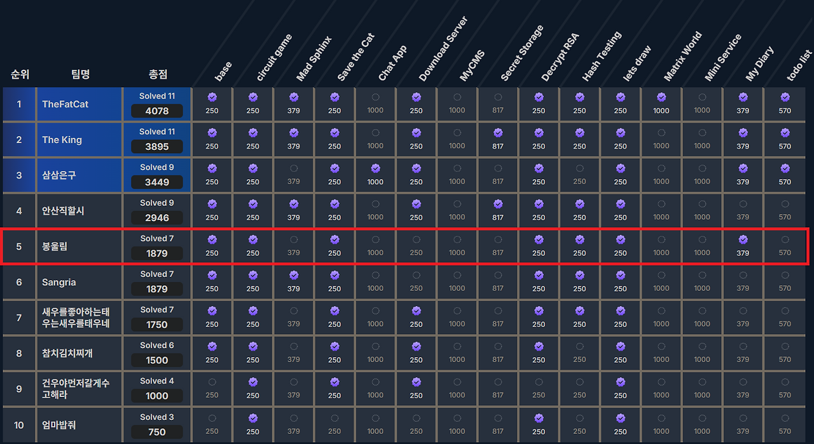
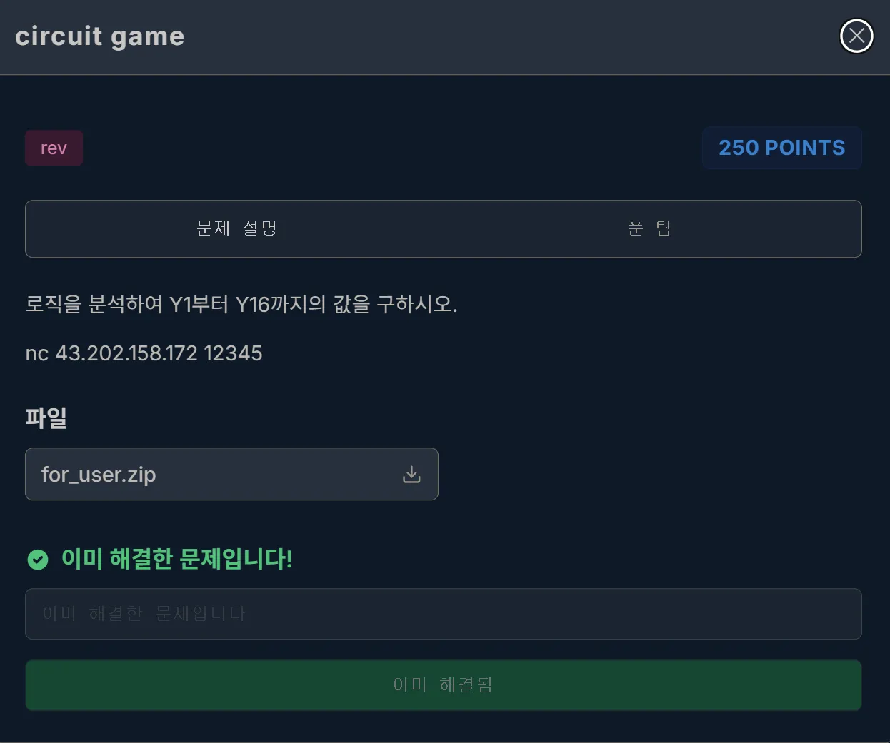
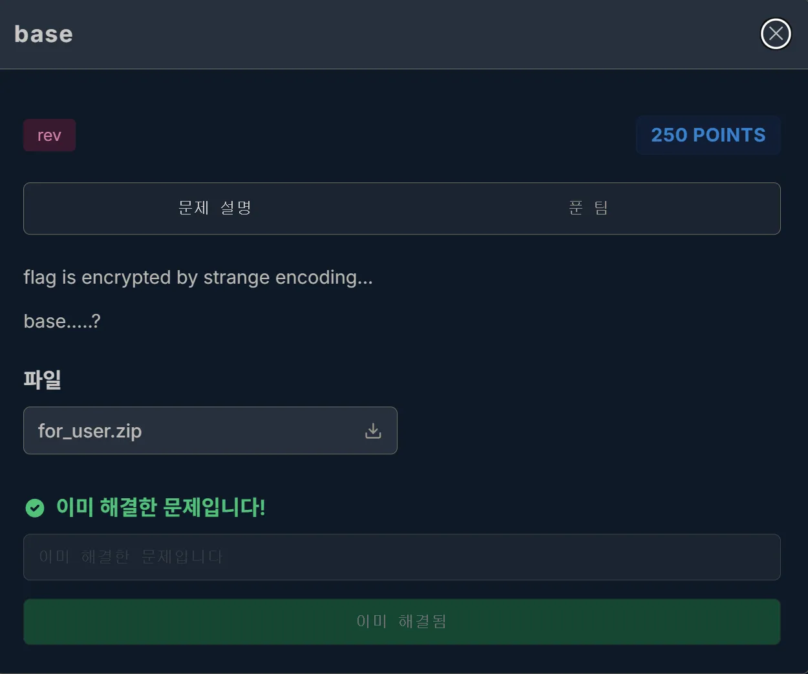
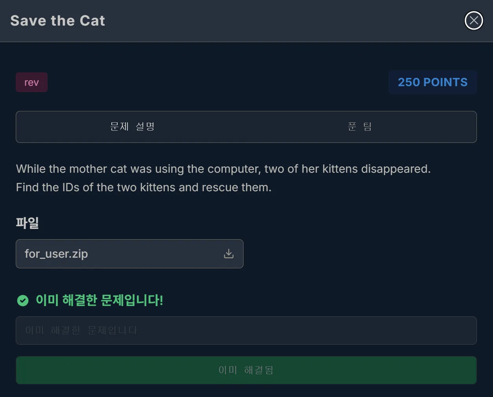
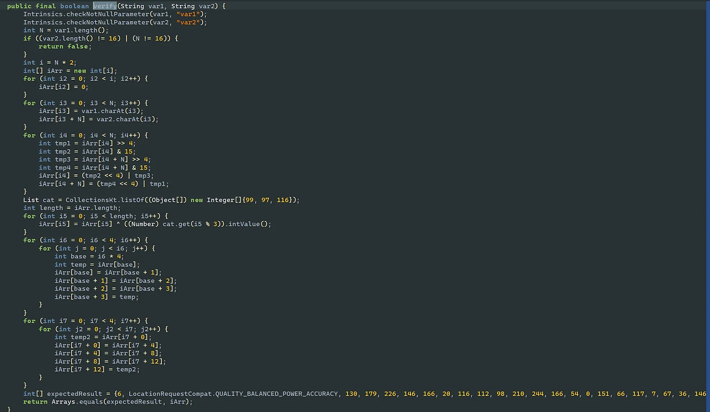
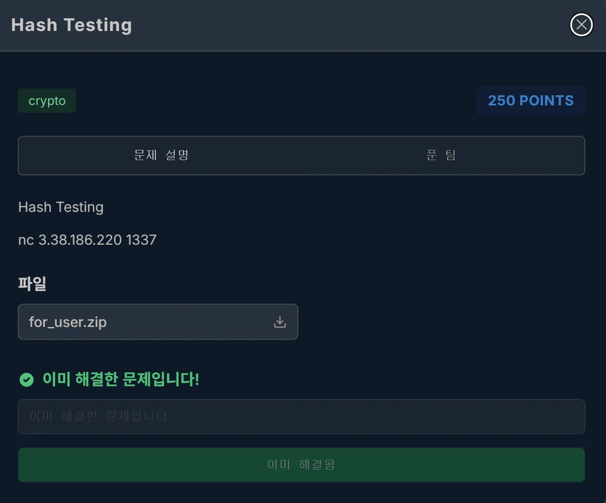

오늘 아주대에 가서 COSS 본선을 뛰고 왔다.

다행히도 아슬아슬하게 5등으로 끝나 상을 받을 수 있었다.  
아주대 COSS ctf를 하기 전까진 capstone 존재 자체도 모르고 있었는데 이번에 대회를 뛰면서 capstone을 좀 쓸 수 있게 된 것 같아서 만족스럽다.  

## rev
### circuit game

문제에서 주어진 prob.txt를 열어보면  

```text
Y1 = NAND(n1,n2)
Y2 = n3 XOR n4
Y3 = NOT(n5 AND n6)
Y4 = Y1 AND n7
Y5 = Y2 OR Y3
Y6 = NOR(n8,n9)
Y7 = NOT(Y5 XOR n10)
Y8 = Y6 NAND Y4
Y9 = (n11 AND n12) OR n11
Y10 = Y7 AND NOT(Y9)
Y11 = NOT(n13 XOR n14)
Y12 = NAND(Y10,Y11)
Y13 = Y12 XOR n15
Y14 = Y8 NOR Y13
Y15 = NOR(n16,NAND(n1,n16))
Y16 = NOT(Y14 AND Y15)
```
이런 식으로 Y1~Y16까지 구하는 연산 식이 적혀 있다.  
여기서 연산에 사용되는 n1~n16을 구해야 하는데, 이 값들은 서버에 접속하면 주어진다.  
때문에 간단하게 서버에 접속했을 때 n1~n16 값 긁어온 후, 해당 연산들 거친 Y1~Y16 값들 입력해 주면 flag를 얻을 수 있다.  

```python
from pwn import *

p = remote("43.202.158.172", 12345)

def NOT(a): return 1 - a
def AND(a, b): return a & b
def OR(a, b):  return a | b
def XOR(a, b): return a ^ b
def NAND(a, b): return NOT(AND(a, b))
def NOR(a, b):  return NOT(OR(a, b))

n = [0] * 16
for i in range(16):
    n[i] = int(p.recvline().decode().split()[1])
print(n)

Y = [0] * 16
Y[0] = NAND(n[0], n[1])
Y[1] = XOR(n[2], n[3])
Y[2] = NOT(AND(n[4], n[5]))
Y[3] = AND(Y[0], n[6])
Y[4] = OR(Y[1], Y[2])
Y[5] = NOR(n[7], n[8])
Y[6] = NOT(XOR(Y[4], n[9]))
Y[7] = NAND(Y[5], Y[3])
Y[8] = OR(AND(n[10], n[11]), n[10])
Y[9] = AND(Y[6], NOT(Y[8]))
Y[10] = NOT(XOR(n[12], n[13]))
Y[11] = NAND(Y[9], Y[10])
Y[12] = XOR(Y[11], n[14])
Y[13] = NOR(Y[7], Y[12])
Y[14] = NOR(n[15], NAND(n[0], n[15]))
Y[15] = NOT(AND(Y[13], Y[14]))

payload = ' '.join(str(i) for i in Y)
print(payload)
p.sendline(payload.encode())
p.interactive()
```

### base

문제 설명만 봐도 base64와 관련 있다는 것을 알 수 있다.  
이 문제는 내 친구 gpt의 도움을 좀 많이 받았다.  
내 친구가 설명해주길 문제에서 주어진 data.txt에 있는 글자를 base64로 인코딩 후, encode_data.txt와 글자 위치를 1:1로 비교하라고 한다.  
그렇게 하면 base64에 사용되는 64개의 글자 중 57개를 알 수 있고, 나머지 7글자는 미정으로 둔 체 디코딩을 시도하는데, 여기서 미정으로 둔 글자가 사용되면 해당 글자는 간단하게 bruteforce로 풀면 된다고 한다.  
이게 bruteforce가 가능한 이유가 encoding 된 flag에서 미정인 글자가 2개 밖에 안되기에 가능한 것이다.  

```python
from itertools import permutations
import base64

alpha = "ABCDEFGHIJKLMNOPQRSTUVWXYZabcdefghijklmnopqrstuvwxyz0123456789+/"
std_enc = base64.b64encode(open("data.txt","rb").read().strip()).decode()

enc_data = open("encode_data.txt","r").read().strip()
fwd = {alpha.index(s): c for s, c in zip(std_enc, enc_data) if s != "="}
rev = {c: i for i, c in fwd.items()}

enc_flag = open("encode_flag.txt","r").read().strip()
unknown = {c for c in enc_flag if c not in rev}
missing  = [31,34,46,58,59,62,63]

def cdecode(s, m):
    idx = [m[ch] for ch in s.rstrip('=')]
    out, pad = bytearray(), s.count('=')
    for a,b,c,d in zip(*[iter(idx + [0,0,0])]*4):
        out += bytes([(a<<2)|(b>>4),
                      ((b&0xF)<<4)|(c>>2),
                      ((c&3)<<6)|d])
    return bytes(out[:-pad] if pad else out)

result = []
for i,j in permutations(missing,2):
    mp = rev|{'s':i,'/':j}
    plain = cdecode(enc_flag, mp)
    if plain.startswith(b'flag{'):
        result.append(plain.decode())

print('\n'.join(i for i in result))
```
최종 코드는 이렇게 되고, 실행시키면 여러 글자가 나오는데 그 중, flag{Base64_find_table}이 flag이다.  

### Save the Cat

고양이를 구하라고 한다.  
이 문제 풀면서 삽질을 좀 많이 해가지고 처음으로 고양이가 보기 싫다는 생각이 들었다.  
<br>
주어진 apk 파일을 jadx로 연 후, com.example.android_prob1.ui.MainScreenKt를 보면  

```java
public static final Unit MainScreen$lambda$13$lambda$12$lambda$11(NavHostController $navController, MutableState $v1$delegate, MutableState $v2$delegate) {
    if (!Calculator.INSTANCE.verify(MainScreen$lambda$1($v1$delegate), MainScreen$lambda$4($v2$delegate))) {
        ToastManager.INSTANCE.m6976showToastM4mJ48M("Incorrect", (r18 & 2) != 0 ? ColorKt.Color(4282786074L) : Color.INSTANCE.m4210getRed0d7_KjU(), (r18 & 4) != 0 ? ColorKt.Color(4294038450L) : Color.INSTANCE.m4213getWhite0d7_KjU(), (r18 & 8) != 0 ? 2000L : 0L, (r18 & 16) != 0 ? Dp.m6657constructorimpl(10) : 0.0f);
    } else {
        NavController.navigate$default((NavController) $navController, "result_screen", (NavOptions) null, (Navigator.Extras) null, 6, (Object) null);
    }
    return Unit.INSTANCE;
}
```
이렇게 Incorrect가 있는 문자열을 볼 수 있다.  
여기서 이게 flag로 가는 길이구나! 하고 촉이왔다.  
<br>

그래서 verify 함수로 들어갔더니 이렇게 누가 봐도 flag 암호화 식이 있었다.  
이를 복호화하여 flag를 획득했다.  

```python
from collections import deque

expected = [6, 102, 130, 179, 226, 146, 166, 20, 116, 112, 98, 210, 244, 166, 54, 0, 151, 66, 117, 7, 67, 36, 146, 51, 230, 87, 135, 85, 39, 50, 85, 182]
key = [ord('c'), ord('a'), ord('t')]

def rotate_right_row(block, k=1):
    d = deque(block)
    d.rotate(k)
    return list(d)

def rotate_right_col(arr, col, k=1):
    idx = [col, col+4, col+8, col+12]
    d   = deque([arr[i] for i in idx])
    d.rotate(k)
    for i, v in zip(idx, d):
        arr[i] = v

def inverse_transform(data):
    for col in reversed(range(4)):
        for _ in range(col):
            rotate_right_col(data, col)

    for blk in reversed(range(4)):
        base = blk * 4
        for _ in range(blk):
            data[base:base+4] = rotate_right_row(data[base:base+4])

    data = [v ^ key[i % 3] for i, v in enumerate(data)]

    kitten1, kitten2 = [], []
    for i in range(16):
        a, b = data[i], data[i+16]
        var1 = ((b & 0xF) << 4) | (a >> 4)
        var2 = ((a & 0xF) << 4) | (b >> 4)
        kitten1.append(chr(var1))
        kitten2.append(chr(var2))
    return ''.join(kitten1), ''.join(kitten2)

id1, id2 = inverse_transform(expected.copy())
print(id1+id2)
```

## crypto
### Hash Testing

이 문제는 내 친구 gpt가 풀어줬다.

```python
from pwn import *
from Crypto.Util.number import *

def to_base_p(x, p, length=None):
    digits = []
    while x:
        digits.append(x % p)
        x //= p
    if length:
        digits += [0]*(length-len(digits))
    return ''.join(chr(d) for d in reversed(digits))

def collide_extend(h, p, m, k):
    d = (-h * (pow(p, k, m) - 1)) % m
    return to_base_p(d, p, k)

io = remote('3.38.186.220', 1337)

# Stage 1
s1 = io.recvline_contains(b'ans =').split(b'=')[1].strip().decode()
p  = int(io.recvline_contains(b'p =').split(b'=')[1])
h  = 0
for ch in s1: h = (h*p + ord(ch)) % (1<<20)
t  = collide_extend(h, p, 1<<20, 7)
io.sendline((s1+t).encode())

# Stage 2
s1 = io.recvline_contains(b'ans =').split(b'=')[1].strip().decode()
p  = int(io.recvline_contains(b'p =').split(b'=')[1])
h  = 0
m2 = 1<<128
for ch in s1: h = (h*p + ord(ch)) % m2
t  = collide_extend(h, p, m2, 8)
io.sendline((s1+t).encode())

# Stage 3
M = (1<<128) + (1<<64) + (1<<32) + (1<<16) + 1
for _ in range(100):
    io.recvline_contains(b'stage')
    p = int(io.recvline_contains(b'p =').split(b'=')[1])
    l = int(io.recvline_contains(b'l =').split(b'=')[1])
    s1 = '\x00' * l
    s2 = to_base_p(M, p, l)
    io.sendline(s1.encode())
    print(s2)
    io.sendline(s2.encode())

print(io.recvall().decode())
```
<br>
아슬아슬하게 5등으로 상을 받아서 그런지 뭔가 찝찝한 맘이 아직도 가시지 않는다.