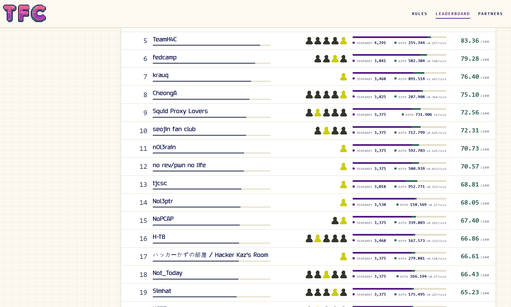

블랙햇 MEA 예선전을 뛰고 생각보다 대회가 일찍 끝나서 같이 예선전 뛰었던 분들과 추가로 TFC CTF를 뛰었다.  

# REV

## LUMAES

check 함수와 lumaes_encrypt_block 함수의 실제 코드는 암호화되어 있으며, 호출 직전에 __enc_enter 함수가 복호화하고 반환 후 다시 암호화한다.  
복호화 루틴은 다음 rolling XOR이다.  

```python
state = (31 * len(key) + 7) & 0xff
for i in range(size):
    state = (state + key[i % len(key)] + i) & 0xff
    code[i] ^= state
```

두 코드의 영역을 복호화하면 정상적인 AArch64 명령어가 나오지만, 내부는 수 MB의 CFF와 MBA로 난독화되어 있다. 이 코드를 전부 정리하는 대신 데이터 영역의 white-box 테이블을 분석했다.  

```text
wb_tii   9 × 16 × 256 × 4 bytes
wb_tiii  9 × 16 × 256 × 4 bytes
wb_xor   9 × 4 × 6 × 8 × 256 bytes
wb_tv    16 × 256 bytes

```

0xb701a0에는 AES의 ShiftRows 순서도 그대로 들어있다.  

```text
00 05 0a 0f 04 09 0e 03 08 0d 02 07 0c 01 06 0b
```

구조상 첫 9라운드는 Type-II/III 테이블과 니블 XOR 테이블을 사용하고, 마지막 라운드는 Type-V 테이블을 사용하는 Chow 계열 white-box AES이다.  

그럼 이제 AES 키를 복구해보자.  
첫 라운드 Type-II 테이블에는 SBOX(input ^ key_byte) 결과가 인코딩되어 있다. 올바른 키 후보에서는 출력 니블을 기준으로 나눈 S-box 값들이 같은 GF(2) 부분공간의 코셋을 이루므로, 각 테이블에서 0x00부터 0xFF까지 검사해 키 바이트를 하나씩 찾을 수 있다.  
16개 테이블에서 복구한 값을 ShiftRows 순서에 맞게 재배치하면 다음 AES-128 키가 나온다.  

```text
5748bc921fb2c852fba0910529f53abe
```

flag_blocks는 4이고, 바로 뒤의 flag_ct에 64바이트 암호문이 저장되어 있다. 복구한 키로 AES-ECB 복호하하면 다음과 같이 flag가 나온다.

```text
TFCCTF{5kr_5kr_wh173b0x_435_15_k1nd4_fun_095dfj2kpf9}\x0b...\x0b
```

```python
from __future__ import annotations
from pathlib import Path
import argparse, hashlib, re, shutil, struct, subprocess

EXPECTED_SHA256 = "17f2d51b65ecfd72951067f2ce231685b39ea7fddfd64946eab75ac52e11a83b"
DATA_VA_TO_FILE_DELTA = 0x410000
WB_TII_VA = 0xB70204
WB_TII_SIZE = 9 * 16 * 256 * 4
FLAG_BLOCKS_VA = 0xC25204
FLAG_CT_VA = 0xC25208
SHIFT_ROWS = [0x00, 0x05, 0x0A, 0x0F, 0x04, 0x09, 0x0E, 0x03,
              0x08, 0x0D, 0x02, 0x07, 0x0C, 0x01, 0x06, 0x0B]
ORACLE_A_BLOCK = bytes.fromhex("83a1e8bff416cb038b735c567721531b")

SBOX = bytes.fromhex(
    "637c777bf26b6fc53001672bfed7ab76"
    "ca82c97dfa5947f0add4a2af9ca472c0"
    "b7fd9326363ff7cc34a5e5f171d83115"
    "04c723c31896059a071280e2eb27b275"
    "09832c1a1b6e5aa0523bd6b329e32f84"
    "53d100ed20fcb15b6acbbe394a4c58cf"
    "d0efaafb434d338545f9027f503c9fa8"
    "51a3408f929d38f5bcb6da2110fff3d2"
    "cd0c13ec5f974417c4a77e3d645d1973"
    "60814fdc222a908846eeb814de5e0bdb"
    "e0323a0a4906245cc2d3ac629195e479"
    "e7c8376d8dd54ea96c56f4ea657aae08"
    "ba78252e1ca6b4c6e8dd741f4bbd8b8a"
    "703eb5664803f60e613557b986c11d9e"
    "e1f8981169d98e949b1e87e9ce5528df"
    "8ca1890dbfe6426841992d0fb054bb16"
)
INV_SBOX = bytes(SBOX.index(i) for i in range(256))


def va_to_file(va: int) -> int:
    return va - DATA_VA_TO_FILE_DELTA


def is_subspace(values: set[int]) -> bool:
    return (
        len(values) == 16
        and 0 in values
        and all((a ^ b) in values for a in values for b in values)
    )


def nibble_matches_key(nibbles: list[int], key_byte: int) -> bool:
    groups: list[list[int]] = [[] for _ in range(16)]
    for x, encoded_nibble in enumerate(nibbles):
        groups[encoded_nibble].append(SBOX[x ^ key_byte])
    if any(len(group) != 16 for group in groups):
        return False

    origin = groups[0][0]
    differences = {value ^ origin for value in groups[0]}
    if not is_subspace(differences):
        return False
    return all(
        {value ^ group[0] for value in group} == differences
        for group in groups[1:]
    )


def recover_key(binary: bytes) -> bytes:
    off = va_to_file(WB_TII_VA)
    wb_tii = binary[off:off + WB_TII_SIZE]
    if len(wb_tii) != WB_TII_SIZE:
        raise ValueError("wb_tii 표가 잘렸습니다")

    table_order: list[int] = []
    table_size = 256 * 4
    for table_index in range(16):
        table = wb_tii[table_index * table_size:(table_index + 1) * table_size]
        output_nibbles: list[list[int]] = []
        for nibble_index in range(8):
            byte_index = nibble_index // 2
            shift = 4 * (nibble_index % 2)
            output_nibbles.append([
                (table[4 * x + byte_index] >> shift) & 0x0F
                for x in range(256)
            ])

        candidates = []
        for key_byte in range(256):
            if any(nibble_matches_key(values, key_byte) for values in output_nibbles):
                candidates.append(key_byte)
        if len(candidates) != 1:
            raise ValueError(
                f"Type-II table {table_index}: 키 후보가 유일하지 않습니다: {candidates}"
            )
        table_order.append(candidates[0])

    key: list[int | None] = [None] * 16
    for table_index, key_byte in enumerate(table_order):
        key[SHIFT_ROWS[table_index]] = key_byte
    if any(value is None for value in key):
        raise AssertionError("ShiftRows 역매핑에 실패했습니다")
    return bytes(value for value in key if value is not None)


def xtime(value: int) -> int:
    return ((value << 1) ^ (0x1B if value & 0x80 else 0)) & 0xFF


def gf_mul(a: int, b: int) -> int:
    result = 0
    for _ in range(8):
        if b & 1:
            result ^= a
        a = xtime(a)
        b >>= 1
    return result & 0xFF


def expand_key(key: bytes) -> list[bytes]:
    if len(key) != 16:
        raise ValueError("AES-128 키는 16바이트여야 합니다")
    expanded = bytearray(key)
    rcon = 1
    while len(expanded) < 176:
        temp = list(expanded[-4:])
        if len(expanded) % 16 == 0:
            temp = temp[1:] + temp[:1]
            temp = [SBOX[value] for value in temp]
            temp[0] ^= rcon
            rcon = xtime(rcon)
        for value in temp:
            expanded.append(expanded[-16] ^ value)
    return [bytes(expanded[i:i + 16]) for i in range(0, 176, 16)]


def add_round_key(state: list[int], round_key: bytes) -> None:
    for i in range(16):
        state[i] ^= round_key[i]


def shift_rows(state: list[int], inverse: bool = False) -> None:
    original = state.copy()
    for row in range(4):
        for column in range(4):
            source_column = (column - row) % 4 if inverse else (column + row) % 4
            state[row + 4 * column] = original[row + 4 * source_column]


def mix_columns(state: list[int], inverse: bool = False) -> None:
    matrix = (
        ((14, 11, 13, 9), (9, 14, 11, 13), (13, 9, 14, 11), (11, 13, 9, 14))
        if inverse
        else ((2, 3, 1, 1), (1, 2, 3, 1), (1, 1, 2, 3), (3, 1, 1, 2))
    )
    for column in range(4):
        values = state[4 * column:4 * column + 4]
        state[4 * column:4 * column + 4] = [
            gf_mul(coefficients[0], values[0])
            ^ gf_mul(coefficients[1], values[1])
            ^ gf_mul(coefficients[2], values[2])
            ^ gf_mul(coefficients[3], values[3])
            for coefficients in matrix
        ]


def aes_encrypt_block(block: bytes, key: bytes) -> bytes:
    round_keys = expand_key(key)
    state = list(block)
    add_round_key(state, round_keys[0])
    for round_number in range(1, 10):
        state[:] = [SBOX[value] for value in state]
        shift_rows(state)
        mix_columns(state)
        add_round_key(state, round_keys[round_number])
    state[:] = [SBOX[value] for value in state]
    shift_rows(state)
    add_round_key(state, round_keys[10])
    return bytes(state)


def aes_decrypt_block(block: bytes, key: bytes) -> bytes:
    round_keys = expand_key(key)
    state = list(block)
    add_round_key(state, round_keys[10])
    for round_number in range(9, 0, -1):
        shift_rows(state, inverse=True)
        state[:] = [INV_SBOX[value] for value in state]
        add_round_key(state, round_keys[round_number])
        mix_columns(state, inverse=True)
    shift_rows(state, inverse=True)
    state[:] = [INV_SBOX[value] for value in state]
    add_round_key(state, round_keys[0])
    return bytes(state)


def pkcs7_unpad(data: bytes, block_size: int = 16) -> bytes:
    if not data or len(data) % block_size:
        raise ValueError("패딩된 데이터 길이가 올바르지 않습니다")
    pad = data[-1]
    if pad == 0 or pad > block_size or data[-pad:] != bytes([pad]) * pad:
        raise ValueError("PKCS#7 패딩이 올바르지 않습니다")
    return data[:-pad]


def solve(path: Path) -> tuple[bytes, bytes]:
    binary = path.read_bytes()
    digest = hashlib.sha256(binary).hexdigest()
    if digest != EXPECTED_SHA256:
        raise ValueError(f"challenge SHA-256 불일치: {digest}")

    key = recover_key(binary)
    if aes_encrypt_block(b"A" * 16, key) != ORACLE_A_BLOCK:
        raise AssertionError("복구 키가 계측 오라클과 일치하지 않습니다")

    blocks_off = va_to_file(FLAG_BLOCKS_VA)
    block_count = struct.unpack_from("<I", binary, blocks_off)[0]
    if block_count != 4:
        raise ValueError(f"예상하지 못한 flag_blocks 값: {block_count}")
    ct_off = va_to_file(FLAG_CT_VA)
    ciphertext = binary[ct_off:ct_off + 16 * block_count]
    if len(ciphertext) != 16 * block_count:
        raise ValueError("flag_ct가 잘렸습니다")

    padded = b"".join(
        aes_decrypt_block(ciphertext[i:i + 16], key)
        for i in range(0, len(ciphertext), 16)
    )
    if b"".join(
        aes_encrypt_block(padded[i:i + 16], key)
        for i in range(0, len(padded), 16)
    ) != ciphertext:
        raise AssertionError("AES 재암호화 검증에 실패했습니다")
    flag = pkcs7_unpad(padded)
    if re.fullmatch(rb"TFCCTF\{[\x20-\x7e]+\}", flag) is None:
        raise ValueError(f"flag 형식이 올바르지 않습니다: {flag!r}")
    return key, flag


def verify_original(path: Path, flag: bytes, sysroot: Path) -> None:
    qemu = shutil.which("qemu-aarch64")
    loader = sysroot / "lib" / "ld-linux-aarch64.so.1"
    if qemu is None or not loader.is_file():
        raise RuntimeError("원본 검증에는 qemu-aarch64와 ARM64 sysroot가 필요합니다")
    result = subprocess.run(
        [qemu, "-L", str(sysroot), str(path), flag.decode("ascii")],
        capture_output=True,
        timeout=30,
        check=False,
    )
    if result.returncode != 0 or result.stdout != b"Correct.\n":
        raise RuntimeError(
            f"원본 검증 실패: rc={result.returncode}, stdout={result.stdout!r}, "
            f"stderr={result.stderr!r}"
        )
    print("원본 검증: Correct. (exit 0)")


def main() -> None:
    parser = argparse.ArgumentParser()
    parser.add_argument("binary", nargs="?", type=Path, default=Path("challenge"))
    parser.add_argument("--verify-run", action="store_true", help="qemu로 원본까지 실행 검증")
    parser.add_argument(
        "--sysroot",
        type=Path,
        default=Path("out/arm64-sysroot/usr/aarch64-linux-gnu"),
    )
    args = parser.parse_args()

    key, flag = solve(args.binary)
    print(f"AES key: {key.hex()}")
    print(f"Flag: {flag.decode('ascii')}")
    if args.verify_run:
        verify_original(args.binary, flag, args.sysroot)


if __name__ == "__main__":
    main()

# TFCCTF{5kr_5kr_wh173b0x_435_15_k1nd4_fun_095dfj2kpf9}
```

## CADENCE

바이너리에서 문자열과 심볼을 확인하자 일반 음악 플레이어 코드 사이에서 ui.encodeKey, encore.resonates, encore.pdf와 다음 문자열을 찾을 수 있었다.  

```text
cadence/resonance/init/v2
cadence/resonance/target/v2
PERFECT CADENCE - the track resonates
```

원격 서비스는 세션마다 16바이트 nonce와 sample rate를 보여주며, 해당 rate를 사용하는 mono 16-bit PCM WAV를 base64로 입력받는다. 디코딩한 WAV에 샘플이 16개보다 많으면 encore.resonates(nonce, rate, samples, len)로 검증한다.  
검증 루틴은 SHA-256으로 초기 상태와 목표 상태를 만든 뒤, 입력 샘플을 8개의 u32 상태로 섞는다. 내부 연산은 XOR, rotate, lane 선택, GF(2) 곱셈으로 구성되어 있다. 분기와 회전량도 샘플 값과 무관하므로, nonce와 rate 및 입력 길이를 고정하면 전체 변환은 GF(2) 위의 어떤 변환이 된다.  

함수 마지막에서는 계산 결과와 목표값을 XOR한 뒤 YMM0가 0인지 검사한다.  

```text
0x10afe49  vpxor  ymm1, ymm1, [rbp-0x50]
0x10afe4e  vpxor  ymm0, ymm1, ymm0
0x10afe52  vpxor  ymm0, ymm0, [constant]
0x10afe5a  vptest ymm0, ymm0
0x10afe5f  sete   al
```

따라서 GDB로 0x10afe5a에 bp를 걸고 YMM0을 읽으면 256비트 출력 오라클을 얻을 수 있다. 32개의 PCM16 샘플을 사용하면 입력은 512비트이므로, 영점 입력과 512개의 단위 벡터를 넣어 다음 식의 상수항과 행렬을 복원했다.  

```text
F(x) = A*x XOR c
A*x = c
```

임의 입력으로 아핀성을 확인한 결과 모든 검사를 통과했고, 복원한 256x512 행렬의 rank는 255였다. python 정수를 bitset으로 사용해 GF(2) 가우스 소거를 수행하면 YMM0을 0으로 만드는 샘플을 구할 수 있다.  

```python
from __future__ import annotations

import argparse
import base64
import io
import json
import os
from pathlib import Path
import random
import re
import shutil
import socket
import ssl
import struct
import subprocess
import time
import wave


FUNC = 0x10AF3C0
COMPARE = 0x10AFE5A
N_SAMPLES = 32
N_BITS = N_SAMPLES * 16
DEFAULT_HOST = "chall-cadence-encore-2c7f87a8f54ac439.challs.ctf.thefewchosen.com"
DEFAULT_PORT = 1337
ANSI_RE = re.compile(rb"\x1b(?:\[[0-?]*[ -/]*[@-~]|\][^\x07]*(?:\x07|\x1b\\))")
FLAG_RE = re.compile(rb"TFCCTF\{[^{}\r\n]+\}")


GDB_COLLECTOR = r'''
import gdb, json, random, re

FUNC = @FUNC@
STOP = @STOP@
RATE = @RATE@
N_SAMPLES = @N_SAMPLES@
NONCE = bytes.fromhex("@NONCE@")
OUT = r"@OUT@"

gdb.execute("set pagination off")
gdb.execute("set confirm off")
gdb.execute("set print thread-events off")
gdb.execute("starti", to_string=True)
base = (int(gdb.parse_and_eval("$rsp")) - 0x100 & ~0xF) + 8
nonce_addr = base - 0x400
samples_addr = base - 0x800
inferior = gdb.selected_inferior()
inferior.write_memory(nonce_addr, NONCE)
bp = gdb.Breakpoint("*%#x" % STOP, internal=True)
bp.silent = True

def oracle(raw):
    assert len(raw) == 2 * N_SAMPLES
    inferior.write_memory(samples_addr, raw)
    gdb.execute("set $rsp=%#x" % base)
    gdb.execute("set $rdi=%#x" % nonce_addr)
    gdb.execute("set $esi=%d" % RATE)
    gdb.execute("set $rdx=%#x" % samples_addr)
    gdb.execute("set $rcx=%d" % N_SAMPLES)
    gdb.execute("set $rip=%#x" % FUNC)
    gdb.execute("continue", to_string=True)
    shown = gdb.execute("p/x $ymm0.v8_int32", to_string=True)
    words = [int(x, 16) for x in re.findall(r"0x[0-9a-fA-F]+", shown)]
    if len(words) != 8:
        raise RuntimeError("YMM0 parse failed: " + shown)
    return sum(word << (32 * i) for i, word in enumerate(words))

zero = bytes(2 * N_SAMPLES)
constant = oracle(zero)
repeat = oracle(zero)
columns = []
for bit in range(16 * N_SAMPLES):
    raw = bytearray(2 * N_SAMPLES)
    raw[bit // 8] = 1 << (bit % 8)
    columns.append(oracle(bytes(raw)) ^ constant)

rng = random.Random(0xCAD3CE)
affine_checks = []
for _ in range(4):
    a = rng.getrandbits(16 * N_SAMPLES)
    b = rng.getrandbits(16 * N_SAMPLES)
    fa = oracle(a.to_bytes(2 * N_SAMPLES, "little"))
    fb = oracle(b.to_bytes(2 * N_SAMPLES, "little"))
    fab = oracle((a ^ b).to_bytes(2 * N_SAMPLES, "little"))
    affine_checks.append((fa ^ fb ^ fab) == constant)

with open(OUT, "w") as fp:
    json.dump({
        "constant": hex(constant),
        "repeat": hex(repeat),
        "columns": [hex(x) for x in columns],
        "affine_checks": affine_checks,
    }, fp)
gdb.execute("kill", to_string=True)
'''


GDB_VERIFIER = r'''
import gdb, json, re

FUNC = @FUNC@
STOP = @STOP@
RATE = @RATE@
NONCE = bytes.fromhex("@NONCE@")
RAW = open(r"@RAW@", "rb").read()
OUT = r"@OUT@"

gdb.execute("set pagination off")
gdb.execute("set confirm off")
gdb.execute("starti", to_string=True)
base = (int(gdb.parse_and_eval("$rsp")) - 0x100 & ~0xF) + 8
nonce_addr = base - 0x400
samples_addr = base - 0x800
inferior = gdb.selected_inferior()
inferior.write_memory(nonce_addr, NONCE)
inferior.write_memory(samples_addr, RAW)
bp = gdb.Breakpoint("*%#x" % STOP, internal=True)
bp.silent = True
gdb.execute("set $rsp=%#x" % base)
gdb.execute("set $rdi=%#x" % nonce_addr)
gdb.execute("set $esi=%d" % RATE)
gdb.execute("set $rdx=%#x" % samples_addr)
gdb.execute("set $rcx=%d" % (len(RAW) // 2))
gdb.execute("set $rip=%#x" % FUNC)
gdb.execute("continue", to_string=True)
shown = gdb.execute("p/x $ymm0.v8_int32", to_string=True)
words = [int(x, 16) for x in re.findall(r"0x[0-9a-fA-F]+", shown)]
diff = sum(word << (32 * i) for i, word in enumerate(words))
with open(OUT, "w") as fp:
    json.dump({"diff": hex(diff), "words": [hex(x) for x in words]}, fp)
gdb.execute("kill", to_string=True)
'''


def render_gdb(template: str, *, nonce: str, rate: int, out: Path, raw: Path | None = None) -> str:
    values = {
        "@FUNC@": hex(FUNC),
        "@STOP@": hex(COMPARE),
        "@RATE@": str(rate),
        "@N_SAMPLES@": str(N_SAMPLES),
        "@NONCE@": nonce,
        "@OUT@": str(out.resolve()),
    }
    if raw is not None:
        values["@RAW@"] = str(raw.resolve())
    for key, value in values.items():
        template = template.replace(key, value)
    return template


def run_gdb(binary: Path, script: Path, timeout: int = 45) -> None:
    if shutil.which("gdb") is None:
        raise RuntimeError("gdb가 PATH에 없습니다.")
    proc = subprocess.run(
        ["gdb", "-q", "-nx", "-batch", "-x", str(script), str(binary)],
        stdout=subprocess.PIPE,
        stderr=subprocess.STDOUT,
        timeout=timeout,
    )
    if proc.returncode != 0:
        raise RuntimeError("GDB 하네스 실패:\n" + proc.stdout.decode("utf-8", "replace"))


def collect_map(binary: Path, out_dir: Path, nonce: str, rate: int) -> tuple[int, list[int]]:
    observations = out_dir / "affine-observations.json"
    script = out_dir / "gdb-collect.py"
    script.write_text(render_gdb(GDB_COLLECTOR, nonce=nonce, rate=rate, out=observations))
    run_gdb(binary, script)
    data = json.loads(observations.read_text())
    constant = int(data["constant"], 16)
    if constant != int(data["repeat"], 16):
        raise RuntimeError("오라클이 결정적이지 않습니다.")
    if not all(data["affine_checks"]):
        raise RuntimeError("GF(2) 아핀성 검증에 실패했습니다.")
    columns = [int(x, 16) for x in data["columns"]]
    if len(columns) != N_BITS:
        raise RuntimeError(f"기저 열 개수 오류: {len(columns)}")
    return constant, columns


def solve_linear(constant: int, columns: list[int]) -> tuple[bytes, int]:
    """Find x such that constant XOR sum(columns[i] * x_i) == 0."""
    basis: dict[int, tuple[int, int]] = {}
    for i, column in enumerate(columns):
        vector = column
        provenance = 1 << i
        while vector:
            pivot = vector.bit_length() - 1
            if pivot in basis:
                vector ^= basis[pivot][0]
                provenance ^= basis[pivot][1]
            else:
                basis[pivot] = (vector, provenance)
                break

    vector = constant
    solution = 0
    while vector:
        pivot = vector.bit_length() - 1
        if pivot not in basis:
            raise RuntimeError(f"선형계에 해가 없습니다(출력 비트 {pivot}).")
        vector ^= basis[pivot][0]
        solution ^= basis[pivot][1]
    return solution.to_bytes(2 * N_SAMPLES, "little"), len(basis)


def make_wav(raw_samples: bytes, rate: int) -> bytes:
    if len(raw_samples) != 2 * N_SAMPLES:
        raise ValueError("샘플 길이가 잘못되었습니다.")
    stream = io.BytesIO()
    with wave.open(stream, "wb") as wav:
        wav.setnchannels(1)
        wav.setsampwidth(2)
        wav.setframerate(rate)
        wav.writeframes(raw_samples)
    result = stream.getvalue()
    if result[0:4] != b"RIFF" or result[8:12] != b"WAVE":
        raise RuntimeError("WAV 생성 실패")
    return result


def verify_solution(binary: Path, out_dir: Path, nonce: str, rate: int, raw: bytes) -> None:
    raw_path = out_dir / "solution.raw"
    result_path = out_dir / "verify.json"
    script = out_dir / "gdb-verify.py"
    raw_path.write_bytes(raw)
    script.write_text(render_gdb(GDB_VERIFIER, nonce=nonce, rate=rate, out=result_path, raw=raw_path))
    run_gdb(binary, script)
    result = json.loads(result_path.read_text())
    if int(result["diff"], 16) != 0 or len(result["words"]) != 8:
        raise RuntimeError("생성한 샘플의 로컬 비교값이 0이 아닙니다.")


def recv_until(sock: ssl.SSLSocket, seconds: float, pattern: re.Pattern[bytes] | None = None) -> bytes:
    chunks: list[bytes] = []
    deadline = time.monotonic() + seconds
    sock.settimeout(0.5)
    while time.monotonic() < deadline:
        try:
            chunk = sock.recv(65536)
        except socket.timeout:
            continue
        if not chunk:
            break
        chunks.append(chunk)
        joined = b"".join(chunks)
        if pattern is not None and pattern.search(joined):
            return joined
    return b"".join(chunks)


def connect_session(host: str, port: int, attempts: int) -> tuple[ssl.SSLSocket, str, int, bytes]:
    context = ssl.create_default_context()
    context.check_hostname = False
    context.verify_mode = ssl.CERT_NONE
    last_error = "배너 없음"
    for attempt in range(1, attempts + 1):
        sock: ssl.SSLSocket | None = None
        try:
            raw = socket.create_connection((host, port), timeout=10)
            sock = context.wrap_socket(raw, server_hostname=host)
            banner = recv_until(sock, 15, re.compile(rb"\[0 chars\]"))
            text = banner.decode("utf-8", "replace")
            nonce_match = re.search(r"SESSION.*?([0-9a-f]{32})", text, re.S)
            rate_match = re.search(r"at (\d+) Hz", text)
            if nonce_match and rate_match:
                return sock, nonce_match.group(1), int(rate_match.group(1)), banner
            last_error = f"시도 {attempt}: 유효한 세션 배너 없음({len(banner)} bytes)"
        except (OSError, ssl.SSLError) as exc:
            last_error = f"시도 {attempt}: {exc}"
        if sock is not None:
            sock.close()
        if attempt != attempts:
            time.sleep(12)
    raise RuntimeError(f"원격 세션 연결 실패: {last_error}")


def clean_terminal(data: bytes) -> str:
    return ANSI_RE.sub(b"", data).decode("utf-8", "replace")


def parse_args() -> argparse.Namespace:
    parser = argparse.ArgumentParser(description="TFC CTF CADENCE solver")
    parser.add_argument("--host", default=DEFAULT_HOST)
    parser.add_argument("--port", type=int, default=DEFAULT_PORT)
    parser.add_argument("--binary", type=Path, default=Path(__file__).resolve().with_name("cadence"))
    parser.add_argument("--out", type=Path, default=Path(__file__).resolve().with_name("out"))
    parser.add_argument("--attempts", type=int, default=4)
    parser.add_argument("--self-test", action="store_true", help="원격 접속 없이 로컬 해만 생성·검증")
    parser.add_argument("--nonce", default="18f0633d83ab69e4400af220d56256b1")
    parser.add_argument("--rate", type=int, default=8000)
    return parser.parse_args()


def main() -> None:
    args = parse_args()
    binary = args.binary.resolve()
    out_dir = args.out.resolve()
    out_dir.mkdir(parents=True, exist_ok=True)
    if not binary.is_file():
        raise FileNotFoundError(binary)

    sock: ssl.SSLSocket | None = None
    if args.self_test:
        nonce, rate = args.nonce.lower(), args.rate
        if not re.fullmatch(r"[0-9a-f]{32}", nonce):
            raise ValueError("nonce는 32자리 16진수여야 합니다.")
    else:
        sock, nonce, rate, banner = connect_session(args.host, args.port, args.attempts)
        (out_dir / "remote-banner.bin").write_bytes(banner)
        print(f"[+] session nonce={nonce} rate={rate}")

    try:
        constant, columns = collect_map(binary, out_dir, nonce, rate)
        raw, rank = solve_linear(constant, columns)
        if rank != 255:
            raise RuntimeError(f"예상하지 못한 행렬 rank: {rank}")
        verify_solution(binary, out_dir, nonce, rate, raw)
        wav = make_wav(raw, rate)
        wav_path = out_dir / "solution.wav"
        wav_path.write_bytes(wav)
        samples = struct.unpack(f"<{N_SAMPLES}h", raw)
        print(f"[+] rank={rank}, samples={N_SAMPLES}, local_diff=0")
        print(f"[+] WAV: {wav_path} ({len(wav)} bytes), first4={samples[:4]}")

        if args.self_test:
            print("[+] self-test 성공")
            return

        assert sock is not None
        payload = base64.b64encode(wav)
        # term.decode에서 실제 Enter는 CR(0x0d)입니다. LF는 제출되지 않습니다.
        sock.sendall(payload + b"\r")
        response = recv_until(sock, 90, FLAG_RE)
        (out_dir / "remote-response.bin").write_bytes(response)
        clean = clean_terminal(response)
        (out_dir / "remote-response.txt").write_text(clean)
        match = FLAG_RE.search(response)
        if not match:
            signals = [x for x in ("PERFECT CADENCE", "Dissonance", "Not a mono", "Wrong sample") if x in clean]
            raise RuntimeError(f"flag를 찾지 못했습니다. 원격 신호={signals}, 로그={out_dir / 'remote-response.bin'}")
        flag = match.group().decode("ascii", "strict")
        print(f"FLAG: {flag}")
    finally:
        if sock is not None:
            sock.close()


if __name__ == "__main__":
    main()

# TFCCTF{the_encore_resonates_over_gf2_7c4e91ab}
```

## RIVERS

바이너리를 실행하면 "brevski noski"라는 실패 문자열만 출력되고, 실제 성공 분기에서는 getenv("FLAG")를 통해 flag를 가져온다.  
프로그램은 세 개의 3변수 희소 다항식과 서로 다른 두 점을 읽는다. 이때 다항식 하나의 형식은 다음과 같다.  

```text
uint16_le 항 개수
반복:
    uint8 x 지수
    uint8 y 지수
    uint8 z 지수
    binary64_le 계수
```

검증 조건은 다음 두 가지다.  

- 세 다항식 F=(F1, F2, F3)의 jacobian determinant가 0이 아닌 상수여야 한다.  
- 서로 다른 두 점 A, B에 대해 F(A)=F(B)여야 한다.  

계수와 좌표는 double로 입력되지만 이후에는 GMP 유리수로 변환되어 계산된다. 따라서 필요한 입력은 jacobian determinant가 상수이면서 서로 다른 두 점을 같은 값으로 보내는 3차원 다항식 사상이다.  

이 조건을 만족하는 다음 3차원 비단사 Keller 사상을 사용했다.  

```text
U  = 1 + xy
F1 = U^3z + y^2U(4 + 3xy)
F2 = y + 3xU^2z + 3xy^2(4 + 3xy)
F3 = 2x - 3x^2y - x^3z
```

이 사상은 다음 성질을 만족한다.  

```text
det(JF) = -2
F(0, 0, -1/4) = F(1, -3/2, 13/2) = (-1/4, 0, 0)
```

식과 충돌점은 [jacobian-counterexample](https://github.com/nasqret/jacobian-counterexample/blob/a9c1695581b270bd73fc47a5ed917cac5bff8d76/artifacts/sympy/verify.py)에서 확인할 수 있다.  

```python
from __future__ import annotations

import argparse
import os
import re
import socket
import ssl
import struct
import subprocess
import time
from fractions import Fraction
from pathlib import Path


HOST = "rivers-bfa46ff1596055d2.challs.ctf.thefewchosen.com"
PORT = 1337
FLAG_RE = re.compile(rb"TFCCTF\{[^}\r\n]+\}")

# (x 지수, y 지수, z 지수, 계수)
F1 = [
    (0, 0, 1, 1),
    (1, 1, 1, 3),
    (2, 2, 1, 3),
    (3, 3, 1, 1),
    (0, 2, 0, 4),
    (1, 3, 0, 7),
    (2, 4, 0, 3),
]
F2 = [
    (0, 1, 0, 1),
    (1, 0, 1, 3),
    (2, 1, 1, 6),
    (3, 2, 1, 3),
    (1, 2, 0, 12),
    (2, 3, 0, 9),
]
F3 = [
    (1, 0, 0, 2),
    (2, 1, 0, -3),
    (3, 0, 1, -1),
]

POINT_A = (Fraction(0), Fraction(0), Fraction(-1, 4))
POINT_B = (Fraction(1), Fraction(-3, 2), Fraction(13, 2))

Monomial = tuple[int, int, int]
Polynomial = dict[Monomial, Fraction]


def canonical(terms: list[tuple[int, int, int, int]]) -> Polynomial:
    """희소 다항식을 표준 라이브러리 Fraction 표현으로 정규화합니다."""
    result: Polynomial = {}
    for x_exp, y_exp, z_exp, coefficient in terms:
        monomial = (x_exp, y_exp, z_exp)
        result[monomial] = result.get(monomial, Fraction(0)) + Fraction(coefficient)
        if result[monomial] == 0:
            del result[monomial]
    return result


def derivative(poly: Polynomial, variable: int) -> Polynomial:
    result: Polynomial = {}
    for monomial, coefficient in poly.items():
        exponent = monomial[variable]
        if exponent == 0:
            continue
        derived = list(monomial)
        derived[variable] -= 1
        key = tuple(derived)
        result[key] = result.get(key, Fraction(0)) + coefficient * exponent
    return {key: value for key, value in result.items() if value}


def add(left: Polynomial, right: Polynomial, sign: int = 1) -> Polynomial:
    result = dict(left)
    for monomial, coefficient in right.items():
        result[monomial] = result.get(monomial, Fraction(0)) + sign * coefficient
        if result[monomial] == 0:
            del result[monomial]
    return result


def multiply(left: Polynomial, right: Polynomial) -> Polynomial:
    result: Polynomial = {}
    for left_monomial, left_coefficient in left.items():
        for right_monomial, right_coefficient in right.items():
            monomial = tuple(a + b for a, b in zip(left_monomial, right_monomial))
            result[monomial] = (
                result.get(monomial, Fraction(0))
                + left_coefficient * right_coefficient
            )
    return {key: value for key, value in result.items() if value}


def evaluate(poly: Polynomial, point: tuple[Fraction, Fraction, Fraction]) -> Fraction:
    total = Fraction(0)
    for exponents, coefficient in poly.items():
        term = coefficient
        for coordinate, exponent in zip(point, exponents):
            term *= coordinate**exponent
        total += term
    return total


def verify_certificate() -> None:
    """바이너리로 보내기 전에 determinant와 collision을 독립 검증합니다."""
    polynomials = [canonical(F1), canonical(F2), canonical(F3)]
    jacobian = [[derivative(poly, variable) for variable in range(3)] for poly in polynomials]

    positive = add(
        multiply(jacobian[0][0], multiply(jacobian[1][1], jacobian[2][2])),
        multiply(jacobian[0][1], multiply(jacobian[1][2], jacobian[2][0])),
    )
    positive = add(
        positive,
        multiply(jacobian[0][2], multiply(jacobian[1][0], jacobian[2][1])),
    )
    negative = add(
        multiply(jacobian[0][2], multiply(jacobian[1][1], jacobian[2][0])),
        multiply(jacobian[0][1], multiply(jacobian[1][0], jacobian[2][2])),
    )
    negative = add(
        negative,
        multiply(jacobian[0][0], multiply(jacobian[1][2], jacobian[2][1])),
    )
    determinant = add(positive, negative, sign=-1)
    assert determinant == {(0, 0, 0): Fraction(-2)}, determinant

    assert POINT_A != POINT_B
    image_a = tuple(evaluate(poly, POINT_A) for poly in polynomials)
    image_b = tuple(evaluate(poly, POINT_B) for poly in polynomials)
    assert image_a == image_b == (Fraction(-1, 4), Fraction(0), Fraction(0))


def encode_polynomial(terms: list[tuple[int, int, int, int]]) -> bytes:
    """uint16_le count || (uint8^3 || binary64_le)* 형식으로 인코딩합니다."""
    if len(terms) > 0x1000:
        raise ValueError("검증기 항 개수 제한을 초과했습니다")
    encoded = bytearray(struct.pack("<H", len(terms)))
    for x_exp, y_exp, z_exp, coefficient in terms:
        if not all(0 <= exponent <= 0x3C for exponent in (x_exp, y_exp, z_exp)):
            raise ValueError("지수 범위를 벗어났습니다")
        if x_exp + y_exp + z_exp > 0x78:
            raise ValueError("총차수 범위를 벗어났습니다")
        encoded += bytes((x_exp & 0xFF, y_exp & 0xFF, z_exp & 0xFF))
        encoded += struct.pack("<d", float(coefficient))
    return bytes(encoded)


def build_payload() -> bytes:
    verify_certificate()
    payload = b"".join(encode_polynomial(poly) for poly in (F1, F2, F3))
    witness = tuple(float(value) for value in POINT_A + POINT_B)
    payload += struct.pack("<6d", *witness)
    assert len(payload) == 230
    return payload


def solve_remote(
    payload: bytes, host: str, port: int, timeout: float, retries: int
) -> bytes:
    last_error: Exception | None = None
    for attempt in range(1, retries + 1):
        response = bytearray()
        try:
            context = ssl.create_default_context()
            context.check_hostname = False
            context.verify_mode = ssl.CERT_NONE
            with socket.create_connection((host, port), timeout=timeout) as raw_socket:
                with context.wrap_socket(raw_socket, server_hostname=host) as tls_socket:
                    tls_socket.settimeout(timeout)
                    tls_socket.sendall(payload)
                    while True:
                        try:
                            chunk = tls_socket.recv(4096)
                        except socket.timeout:
                            break
                        if not chunk:
                            break
                        response += chunk
            match = FLAG_RE.search(response)
            if match is not None:
                return match.group(0)
            last_error = RuntimeError(f"flag 없는 원격 응답: {bytes(response)!r}")
        except (OSError, ssl.SSLError) as error:
            last_error = error
        if attempt != retries:
            time.sleep(1.0)
    raise RuntimeError(f"{retries}회 원격 시도 실패: {last_error}")


def solve_local(payload: bytes, binary: Path) -> bytes:
    if not binary.is_file():
        raise FileNotFoundError(binary)
    marker = b"TFCCTF{LOCAL_VALIDATION_MARKER}"
    environment = dict(os.environ)
    environment["FLAG"] = marker.decode()
    completed = subprocess.run(
        [str(binary.resolve())],
        input=payload,
        stdout=subprocess.PIPE,
        stderr=subprocess.PIPE,
        env=environment,
        timeout=10,
        check=True,
    )
    if marker not in completed.stdout:
        raise RuntimeError(
            f"로컬 검증 실패: stdout={completed.stdout!r}, stderr={completed.stderr!r}"
        )
    return marker


def main() -> None:
    parser = argparse.ArgumentParser(description=__doc__)
    parser.add_argument("--local", action="store_true", help="로컬 ./rivers로 검증")
    parser.add_argument("--binary", type=Path, default=Path("./rivers"))
    parser.add_argument("--host", default=HOST)
    parser.add_argument("--port", type=int, default=PORT)
    parser.add_argument("--timeout", type=float, default=10.0)
    parser.add_argument("--retries", type=int, default=3)
    parser.add_argument("--save-payload", type=Path, help="직렬화 입력을 파일로 저장")
    args = parser.parse_args()

    payload = build_payload()
    if args.save_payload is not None:
        args.save_payload.parent.mkdir(parents=True, exist_ok=True)
        args.save_payload.write_bytes(payload)
        print(f"Payload: {args.save_payload.resolve()} ({len(payload)} bytes)")

    flag = (
        solve_local(payload, args.binary)
        if args.local
        else solve_remote(payload, args.host, args.port, args.timeout, args.retries)
    )
    print(f"Flag: {flag.decode()}")


if __name__ == "__main__":
    main()

# TFCCTF{even_math_is_cooked_its_so_joever}
```

## MINIGAME

먼저 바이너리 문자열을 확인한 결과 다음 문구를 찾을 수 있었다.  

```text
WRONG LEVER  SEQUENCE RESET
CIPHER ACCEPTED  VAULT OPEN
CIPHER PANELS  TOP 4  MID 2  BOT 1  READ L TO R
```

"CIPHER ACCEPTED VAULT OPEN"의 xrefs를 따라가면 렌더 함수와 flag 출력 버퍼인 0x1406630을 찾을 수 있다. 이 버퍼의 쓰기 xrefs를 따라가면 lever 검사 로직과 복호화 함수 sub_11EF760에 도달한다.  
lever를 사용할 때마다 입력 값을 0x1000880의 정답 배열과 비교한다. 값이 틀리면 진행도가 0으로 초기화되고, 16개가 모두 맞으면 복호화 함수가 호출된다.  

```text
5, 1, 6, 2, 7, 0, 3, 4, 1, 7, 2, 5, 0, 6, 4, 3
```

최종 보스를 잡았을 때도 게임은 이 배열을 입력 버퍼에 복사한 뒤 같은 함수를 호출한다. 따라서 정상 플레이나 화면의 cipher panel을 해석할 필요 없이 이 배열을 그대로 사용하면 된다.  
sub_11EF760 함수는 lever 배열로 64비트 seed를 만든 후, 0x100F7D5에 저장된 39바이트 암호문을 xorshift64* 키스트림과 XOR 한다.  

```text
state ^= state >> 12
state ^= (state << 25) & 0xFFFFFFFFFFFFFFFF
state ^= state >> 27
key = ((state * 0x2545F4914F6CDD1D) & 0xFFFFFFFFFFFFFFFF) >> 56
plain = encrypted ^ key
```

```python
from __future__ import annotations

import argparse
import hashlib
import struct
from pathlib import Path


MASK64 = 0xFFFFFFFFFFFFFFFF
EXPECTED_SHA256 = "b8758421e8bfd24e569f8109954b37c07951dc2301e6d6723989b8fab6ec03f5"
SEQUENCE_VADDR = 0x1000880
CIPHERTEXT_VADDR = 0x100F7D5
FLAG_LENGTH = 39

ROUND_CONSTANTS = [
    0x9E3779B97F4A7C15,
    0x9E3778B97F4A7DA6,
    0x9E377BB97F4A7F73,
    0x9E377AB97F4A790C,
    0x9E377DB97F4A7AD9,
    0x9E377CB97F4A746A,
    0x9E377FB97F4A7627,
    0x9E377EB97F4A77F0,
    0x9E3771B97F4A718D,
    0x9E3770B97F4A735E,
    0x9E3773B97F4A6CEB,
    0x9E3772B97F4A6EA4,
    0x9E3775B97F4A6871,
    0x9E3774B97F4A6A02,
    0x9E3777B97F4A6BDF,
    0x9E3776B97F4A6568,
]
MIX_MULTIPLIER = 0xBF58476D1CE4E5B9
XORSHIFT_MULTIPLIER = 0x2545F4914F6CDD1D


def ror64(value: int, count: int) -> int:
    value &= MASK64
    return ((value >> count) | (value << (64 - count))) & MASK64


def vaddr_to_offset(elf: bytes, vaddr: int) -> int:
    """ELF64 LE의 PT_LOAD를 이용해 가상주소를 파일 오프셋으로 바꿉니다."""
    if elf[:6] != b"\x7fELF\x02\x01":
        raise ValueError("입력 파일이 little-endian ELF64가 아닙니다")

    phoff = struct.unpack_from("<Q", elf, 0x20)[0]
    phentsize = struct.unpack_from("<H", elf, 0x36)[0]
    phnum = struct.unpack_from("<H", elf, 0x38)[0]
    if phentsize < 56:
        raise ValueError(f"비정상 ELF program header 크기: {phentsize}")

    for index in range(phnum):
        pos = phoff + index * phentsize
        p_type, _, p_offset, p_vaddr, _, p_filesz, _, _ = struct.unpack_from(
            "<IIQQQQQQ", elf, pos
        )
        if p_type == 1 and p_vaddr <= vaddr < p_vaddr + p_filesz:
            return p_offset + (vaddr - p_vaddr)
    raise ValueError(f"가상주소 0x{vaddr:X}가 파일-backed PT_LOAD에 없습니다")


def derive_seed(sequence: bytes) -> int:
    if len(sequence) != len(ROUND_CONSTANTS):
        raise ValueError("lever sequence 길이는 정확히 16바이트여야 합니다")

    state = ror64(
        ((ROUND_CONSTANTS[0] * (sequence[0] + 1)) & MASK64)
        ^ 0x243F6A8885A308D3,
        51,
    )
    for value, constant in zip(sequence[1:], ROUND_CONSTANTS[1:]):
        mixed = (MIX_MULTIPLIER * state) & MASK64
        state = ror64(
            mixed ^ (mixed >> 29) ^ ((constant * (value + 1)) & MASK64),
            51,
        )

    mixed = (MIX_MULTIPLIER * state) & MASK64
    return (mixed ^ (mixed >> 29) ^ 0x13198A2E03707344) & MASK64


def xorshift64(state: int) -> int:
    state ^= state >> 12
    state ^= (state << 25) & MASK64
    state ^= state >> 27
    return state & MASK64


def decrypt(sequence: bytes, ciphertext: bytes) -> bytes:
    state = derive_seed(sequence)
    plaintext = bytearray()
    for byte in ciphertext:
        state = xorshift64(state)
        key_byte = ((XORSHIFT_MULTIPLIER * state) & MASK64) >> 56
        plaintext.append(byte ^ key_byte)
    return bytes(plaintext)


def solve(binary_path: Path) -> bytes:
    elf = binary_path.read_bytes()
    digest = hashlib.sha256(elf).hexdigest()
    if digest != EXPECTED_SHA256:
        raise ValueError(f"원본 바이너리 SHA-256 불일치: {digest}")

    seq_offset = vaddr_to_offset(elf, SEQUENCE_VADDR)
    enc_offset = vaddr_to_offset(elf, CIPHERTEXT_VADDR)
    sequence = elf[seq_offset : seq_offset + 16]
    ciphertext = elf[enc_offset : enc_offset + FLAG_LENGTH]

    expected_sequence = bytes(
        [0x05, 0x01, 0x06, 0x02, 0x07, 0x00, 0x03, 0x04,
         0x01, 0x07, 0x02, 0x05, 0x00, 0x06, 0x04, 0x03]
    )
    if sequence != expected_sequence:
        raise ValueError(f"예상하지 못한 lever sequence: {sequence.hex()}")
    if len(ciphertext) != FLAG_LENGTH:
        raise ValueError("암호문 추출 길이가 39바이트가 아닙니다")

    flag = decrypt(sequence, ciphertext)
    if not (flag.startswith(b"TFCCTF{") and flag.endswith(b"}")):
        raise ValueError(f"복호화 결과가 flag 형식이 아닙니다: {flag!r}")
    return flag


def main() -> None:
    parser = argparse.ArgumentParser(description=__doc__)
    parser.add_argument(
        "binary",
        nargs="?",
        type=Path,
        default=Path(__file__).resolve().parent / "minigame",
        help="원본 minigame 경로 (기본값: solve.py 옆의 minigame)",
    )
    args = parser.parse_args()
    print(f"Flag: {solve(args.binary).decode('ascii')}")


if __name__ == "__main__":
    main()

# TFCCTF{r3dst0n3_c1rcu1t_v4ult_unl0ck3d}
```

## PROJECT AMERICAS

문제에서 주어진 세 DLL에는 다음과 같은 문자열이 들어있다.  

```text
AES-256-CBC key=VI_LEAKED_BUILD_2026
C:\buildagent\workspace\gta6_dev\rage\streaming.pdb
```

하지만 DLL의 .text 섹션에는 사실상 ret만 존재한다. 실행 파일에서도 이 문자열은 cryptDecoy라는 미끼 루틴에만 사용되므로 실제 AES 키가 아니다.  
실제 키 재료는 DLL의 .rdata에 있는 TFCSHARD/V1 레코드이다.  

```text
TFCSHARD/V1\0 | role:u8 | 0x20 | encrypted_shard[32]
```

같은 영역에 challenge ID도 남아 있었다.  

```text
AMERICAS-20dbcdd7061b4ccabfe947ef
```

프로그램의 hashParts는 각 데이터 앞에 little-endian uint32 길이를 붙여 SHA-256을 계산한다.  

```text
H(parts...) = SHA256(len(part0) || part0 || len(part1) || part1 || ...)
```

각 DLL의 shard는 다음 식으로 복원된다.  

```text
mask = H(
    "Microsoft CodeView RSDS",
    challenge_id,
    DLL 상대 경로,
    role || "GTA"
)

shard = encrypted_shard XOR mask
```

세 shard를 XOR한 root seed는 다음과 같다.  

```text
5a4159ffaf885e3485f183692150f4985f859fac1e36639088740063349fccf5
```

patch_06.dat에는 키 생성에 사용되는 산술 VM이 들어있다. 파일은 다음 변환을 거쳐 풀리게 된다.  

```text
ASCII85 decode
→ custom stream XOR
→ 전체 바이트 역순
→ gzip decompress
→ VM bytecode
```

복원된 bytecode는 MATHVM1\0 헤더와 137개의 8바이트 명령으로 구성된다.  

```text
opcode:u8 | a:u8 | b:u8 | c:u8 | immediate:u32-le
```

VM은 8개의 32비트 레지스터를 사용하며 프로그램 전체를 네 번 실행한다. opcode는 덧셈, XOR, 곱셈, rotate와 0x1B reduction을 조합한다.  

키 생성 함수 deriveMaterial은 root seed, challenge ID, 컨테이너 context를 SHA-256으로 묶은 뒤 VM 출력과 다시 해시하는 과정을 반복한다.  

```text
chain = H("TFCCTF/key-ladder/v4", root_seed, challenge_id, context)

regs  = VM(program, chain, counter XOR 0x564D0000)
chain = H("register-fold", chain, regs)
```

flag.txt는 두 겹의 컨테이너다. 외부 v4 컨테이너를 인증하고 복호하하면 TFCENC3\0으로 시작하는 167바이트 내부 컨테이너가 나온다.  

```text
v4 outer container
→ HMAC-SHA256 검증
→ 36-round custom block decrypt
→ PKCS#7 unpad
→ v3 inner container
→ HMAC-SHA256 검증
→ custom block decrypt
→ PKCS#7 unpad
→ flag
```

외부 컨테이너는 RSC7-AUTH-V4 prefix까지 HMAC 입력에 포함되며, 내부 컨테이너는 prefix 없이 컨테이너 본문을 인증한다. 두 HMAC이 모두 일치한 뒤 최종 flag를 얻을 수 있다.  

```python
import argparse
import base64
import gzip
import hashlib
import hmac
import re
import struct
from pathlib import Path

MASK32 = 0xFFFFFFFF
MASK64 = 0xFFFFFFFFFFFFFFFF
OUTER_MAGIC = bytes([0x52, 0x53, 0x43, 0x07, 0xF1, 0x9A, 0x44, 0xC3])
INNER_MAGIC = b"TFCENC3\0"


def require(condition: bool, message: str) -> None:
    if not condition:
        raise ValueError(message)


def hash_parts(*parts: bytes) -> bytes:
    """각 조각에 uint32-le 길이를 붙여 SHA-256합니다."""
    digest = hashlib.sha256()
    for part in parts:
        digest.update(struct.pack("<I", len(part)))
        digest.update(part)
    return digest.digest()


def rol8(value: int, count: int) -> int:
    count &= 7
    value &= 0xFF
    return ((value << count) | (value >> ((8 - count) & 7))) & 0xFF


def rol32(value: int, count: int) -> int:
    count &= 31
    value &= MASK32
    return ((value << count) | (value >> ((32 - count) & 31))) & MASK32


def rol64(value: int, count: int) -> int:
    count &= 63
    value &= MASK64
    return ((value << count) | (value >> ((64 - count) & 63))) & MASK64


def pe_rdata(path: Path) -> bytes:
    data = path.read_bytes()
    require(data[:2] == b"MZ", f"PE가 아닙니다: {path}")
    pe_offset = struct.unpack_from("<I", data, 0x3C)[0]
    require(data[pe_offset:pe_offset + 4] == b"PE\0\0", f"PE 서명이 없습니다: {path}")
    section_count = struct.unpack_from("<H", data, pe_offset + 6)[0]
    optional_size = struct.unpack_from("<H", data, pe_offset + 20)[0]
    section_table = pe_offset + 24 + optional_size
    for index in range(section_count):
        offset = section_table + 40 * index
        name = data[offset:offset + 8].rstrip(b"\0")
        raw_size, raw_offset = struct.unpack_from("<II", data, offset + 16)
        if name == b".rdata":
            require(raw_offset + raw_size <= len(data), f"잘못된 .rdata 범위: {path}")
            return data[raw_offset:raw_offset + raw_size]
    raise ValueError(f".rdata 섹션이 없습니다: {path}")


def recover_challenge_id(dll_paths: list[Path]) -> bytes:
    marker = b"RAGEBUILD/V1\0"
    found = set()
    for path in dll_paths:
        rdata = pe_rdata(path)
        offset = rdata.find(marker)
        require(offset >= 0, f"challenge ID marker가 없습니다: {path}")
        offset += len(marker)
        size = rdata[offset]
        challenge_id = rdata[offset + 1:offset + 1 + size]
        require(re.fullmatch(rb"AMERICAS-[0-9a-f]{24}", challenge_id) is not None,
                f"잘못된 challenge ID: {path}")
        found.add(challenge_id)
    require(len(found) == 1, "DLL별 challenge ID가 일치하지 않습니다")
    return found.pop()


def extract_shard(path: Path, challenge_root: Path, challenge_id: bytes) -> tuple[int, bytes]:
    rdata = pe_rdata(path)
    marker = b"TFCSHARD/V1\0"
    offset = rdata.find(marker)
    require(offset >= 0, f"shard marker가 없습니다: {path}")
    offset += len(marker)
    role, size = rdata[offset], rdata[offset + 1]
    require(size == 32, f"shard 크기가 32가 아닙니다: {path}")
    encrypted = rdata[offset + 2:offset + 34]
    relative_path = path.relative_to(challenge_root).as_posix().encode()
    mask = hash_parts(
        b"Microsoft CodeView RSDS",
        challenge_id,
        relative_path,
        bytes([role]) + b"GTA",
    )
    return role, bytes(a ^ b for a, b in zip(encrypted, mask))


def recover_root_seed(challenge_root: Path, challenge_id: bytes) -> bytes:
    dll_paths = sorted((challenge_root / "bin").glob("*.dll"))
    require(len(dll_paths) == 3, "필수 DLL 3개를 찾지 못했습니다")
    shards = [extract_shard(path, challenge_root, challenge_id) for path in dll_paths]
    require(sorted(role for role, _ in shards) == [1, 2, 3], "shard role 1, 2, 3이 필요합니다")
    return bytes(a ^ b ^ c for a, b, c in zip(*(shard for _, shard in shards)))


def stream_xor(source: bytes, key: bytes) -> bytes:
    require(bool(key), "stream key가 비었습니다")
    seed = hash_parts(b"TFCCTF/americas/stream/v1", key)
    state = struct.unpack_from("<Q", seed)[0] | 1
    output = bytearray(len(source))
    for index, byte in enumerate(source):
        if (index & 0x3F) == 0:
            state = rol64(
                state ^ ((0x9E3779B97F4A7C15 * (index + 1)) & MASK64),
                23,
            )
        state ^= (state << 13) & MASK64
        state ^= state >> 7
        state ^= (state << 17) & MASK64
        state &= MASK64
        output[index] = byte ^ ((state >> 29) & 0xFF) ^ key[index % len(key)]
    return bytes(output)


def unpack_program(patch_path: Path, challenge_id: bytes) -> list[tuple[int, int, int, int, int]]:
    wrapped = patch_path.read_bytes()
    require(wrapped.startswith(b"RPFVM01\n"), "stage-1 헤더가 잘못되었습니다")
    try:
        stage1 = base64.a85decode(wrapped[8:])
    except ValueError as error:
        raise ValueError("stage-1 ASCII85 디코딩에 실패했습니다") from error
    key = hash_parts(b"Project-Americas/stage-1", challenge_id)
    try:
        stage2 = gzip.decompress(stream_xor(stage1, key)[::-1])
    except (OSError, EOFError) as error:
        raise ValueError("stage-2 gzip 해제에 실패했습니다") from error

    require(stage2[:8] == b"MATHVM1\0", "stage-2 VM 헤더가 잘못되었습니다")
    require(len(stage2) >= 16, "stage-2 VM 데이터가 너무 짧습니다")
    count = struct.unpack_from("<H", stage2, 8)[0]
    body = stage2[16:]
    require(0 < count <= 0x1000 and len(body) == 8 * count, "VM 명령 수가 잘못되었습니다")
    require(hashlib.sha256(body).digest()[:6] == stage2[10:16], "VM checksum이 일치하지 않습니다")

    instructions = [struct.unpack_from("<BBBBI", body, 8 * index) for index in range(count)]
    require(all(1 <= op <= 7 and a < 8 and b < 8 and c < 8
                for op, a, b, c, _ in instructions), "VM opcode 또는 레지스터가 잘못되었습니다")
    return instructions


def run_program(
    instructions: list[tuple[int, int, int, int, int]],
    salt: int,
    initial: bytes,
) -> bytes:
    require(len(initial) == 32, "VM 초기 상태는 32바이트여야 합니다")
    registers = [
        (word ^ salt ^ (0x6A09E667 * index)) & MASK32
        for index, word in enumerate(struct.unpack("<8I", initial))
    ]

    for round_index in range(4):
        for pc, (opcode, a, b, c, immediate) in enumerate(instructions):
            old = registers.copy()
            mix = (
                immediate
                ^ (0x85EBCA6B * pc)
                ^ (0xC2B2AE35 * round_index)
            ) & MASK32
            if opcode == 1:
                registers[a] = (
                    old[a] + rol32(mix ^ old[b], (old[c] ^ mix) & 31)
                ) & MASK32
            elif opcode == 2:
                registers[a] = (
                    old[a] ^ ((old[b] + rol32(mix, old[c] & 31)) & MASK32)
                ) & MASK32
            elif opcode == 3:
                registers[a] = (
                    (old[c] ^ old[a]) * (old[b] | 1) + mix
                ) & MASK32
            elif opcode == 4:
                registers[a] = rol32(
                    old[a] + mix,
                    ((old[c] & 0xFF) ^ (old[b] & 0xFF)) & 31,
                )
            elif opcode == 5:
                value = old[b] ^ mix
                folded = (
                    0x1B873593
                    * rol32((0xCC9E2D51 * value) & MASK32, 15)
                ) & MASK32
                registers[a] = (old[a] ^ old[c] ^ folded) & MASK32
            elif opcode == 6:
                value = old[c] ^ old[b] ^ mix
                xtime = ((value << 1) ^ (0x1B if value >> 31 else 0)) & MASK32
                registers[a] = (old[a] ^ xtime) & MASK32
            elif opcode == 7:
                registers[a] = (old[b] ^ mix) & MASK32
                registers[b] = (old[c] + old[a]) & MASK32
    return struct.pack("<8I", *registers)


def derive_material(
    challenge_id: bytes,
    context: bytes,
    instructions: list[tuple[int, int, int, int, int]],
    size: int,
    root_seed: bytes,
) -> bytes:
    require(len(root_seed) == 32, "root seed는 32바이트여야 합니다")
    chain = hash_parts(b"TFCCTF/key-ladder/v4", root_seed, challenge_id, context)
    output = bytearray()
    counter = 0
    while len(output) < size:
        registers = run_program(instructions, counter ^ 0x564D0000, chain)
        chain = hash_parts(b"register-fold", chain, registers)
        output.extend(chain)
        counter += 1
    return bytes(output[:size])


def make_round_keys(material: bytes) -> list[int]:
    require(len(material) >= 64, "round key material이 부족합니다")
    words = struct.unpack("<16I", material[:64])
    return [
        rol32(words[index & 15] ^ ((0x9E3779B9 * index) & MASK32), 11 * index)
        for index in range(36)
    ]


def block_decrypt(block: bytes, round_keys: list[int]) -> bytes:
    require(len(block) == 16 and len(round_keys) == 36, "block/round key 크기가 잘못되었습니다")
    word0, word1, word2, word3 = struct.unpack("<4I", block)
    for round_index in range(35, -1, -1):
        saved_word1 = word1
        keyed_word2 = (word2 ^ round_keys[round_index]) & MASK32
        left = rol32(
            word0 + (keyed_word2 ^ ((0x9E3779B9 * round_index) & MASK32)),
            (word2 ^ (round_keys[round_index] & 0xFF) ^ word1) & 31,
        )
        right = (
            0x7F4A7C15 * (word1 ^ rol32(keyed_word2, round_index))
        ) & MASK32
        temp = (
            (left ^ right) * (((2 * round_index) ^ 0x85EBCA6B) | 1)
        ) & MASK32
        folded = (
            (0xC2B2AE35 * (temp ^ ((temp >> 16) & 0xFFFF))) & MASK32
        ) ^ rol32(saved_word1 ^ word0, 7 * round_index)
        word0, word1, word2, word3 = (
            (word3 ^ (folded >> 13) ^ folded) & MASK32,
            word0,
            saved_word1,
            word2,
        )
    return struct.pack("<4I", word0, word1, word2, word3)


def pkcs7_unpad(data: bytes) -> bytes:
    require(bool(data), "padding 대상이 비었습니다")
    padding = data[-1]
    require(1 <= padding <= 16, "PKCS#7 padding 길이가 잘못되었습니다")
    require(data[-padding:] == bytes([padding]) * padding, "PKCS#7 padding 값이 잘못되었습니다")
    return data[:-padding]


def unseal_outer(
    blob: bytes,
    challenge_id: bytes,
    instructions: list[tuple[int, int, int, int, int]],
    root_seed: bytes,
) -> bytes:
    require(len(blob) >= 96 and blob[:8] == OUTER_MAGIC, "v4 outer container가 아닙니다")
    version, header_size = struct.unpack_from("<HH", blob, 8)
    require((version, header_size) == (4, 48), "v4 outer header가 잘못되었습니다")
    salt, iv = blob[12:28], blob[28:44]
    cipher_size = struct.unpack_from("<I", blob, 44)[0]
    require(cipher_size > 0 and cipher_size % 16 == 0, "v4 cipher 크기가 잘못되었습니다")
    require(len(blob) == 48 + cipher_size + 32, "v4 container 전체 길이가 잘못되었습니다")

    material = derive_material(
        challenge_id,
        b"RSC7/runtime-seal/" + salt,
        instructions,
        96,
        root_seed,
    )
    expected_tag = hmac.new(
        material[64:96],
        b"RSC7-AUTH-V4" + blob[:-32],
        hashlib.sha256,
    ).digest()
    require(hmac.compare_digest(expected_tag, blob[-32:]), "v4 HMAC 인증에 실패했습니다")

    round_keys = make_round_keys(material)
    plaintext = bytearray()
    previous = iv
    for offset in range(0, cipher_size, 16):
        block = blob[48 + offset:48 + offset + 16]
        transformed = block_decrypt(block, round_keys)
        block_index = offset // 16
        for byte_index in range(16):
            tweak = (
                rol8(13 * byte_index, block_index)
                + (((31 * byte_index + 47 * block_index) & 0xFF) ^ 0xA5)
            ) & 0xFF
            plaintext.append(transformed[byte_index] ^ previous[byte_index] ^ tweak)
        previous = block
    return pkcs7_unpad(bytes(plaintext))


def decrypt_inner(
    blob: bytes,
    challenge_id: bytes,
    instructions: list[tuple[int, int, int, int, int]],
    root_seed: bytes,
) -> bytes:
    require(len(blob) >= 82 and blob[:8] == INNER_MAGIC, "v3 inner container가 아닙니다")
    version, header_size = struct.unpack_from("<HH", blob, 8)
    require((version, header_size) == (3, 50), "v3 inner header가 잘못되었습니다")
    salt, iv = blob[12:28], blob[28:44]
    metadata_size = struct.unpack_from("<H", blob, 44)[0]
    cipher_size = struct.unpack_from("<I", blob, 46)[0]
    cipher_offset = 50 + metadata_size
    require(cipher_size > 0 and cipher_size % 16 == 0, "v3 cipher 크기가 잘못되었습니다")
    require(len(blob) == cipher_offset + cipher_size + 32, "v3 container 전체 길이가 잘못되었습니다")

    material = derive_material(challenge_id, salt, instructions, 96, root_seed)
    expected_tag = hmac.new(material[64:96], blob[:-32], hashlib.sha256).digest()
    require(hmac.compare_digest(expected_tag, blob[-32:]), "v3 HMAC 인증에 실패했습니다")

    round_keys = make_round_keys(material)
    plaintext = bytearray()
    previous = iv
    for offset in range(0, cipher_size, 16):
        block = blob[cipher_offset + offset:cipher_offset + offset + 16]
        transformed = block_decrypt(block, round_keys)
        block_index = offset // 16
        for byte_index in range(16):
            tweak = (17 * byte_index + 29 * block_index) & 0xFF
            plaintext.append(transformed[byte_index] ^ previous[byte_index] ^ tweak)
        previous = block
    return pkcs7_unpad(bytes(plaintext))


def solve(challenge_root: Path, output_dir: Path) -> bytes:
    dll_paths = sorted((challenge_root / "bin").glob("*.dll"))
    require(len(dll_paths) == 3, "challenge/bin의 DLL 3개가 필요합니다")
    challenge_id = recover_challenge_id(dll_paths)
    root_seed = recover_root_seed(challenge_root, challenge_id)
    instructions = unpack_program(challenge_root / "content/patch_06.dat", challenge_id)
    outer = (challenge_root / "challenge_data/flag.txt").read_bytes()
    inner = unseal_outer(outer, challenge_id, instructions, root_seed)
    flag = decrypt_inner(inner, challenge_id, instructions, root_seed)
    require(re.fullmatch(rb"TFCCTF\{[ -~]{8,160}\}", flag) is not None, "flag 형식이 잘못되었습니다")

    output_dir.mkdir(parents=True, exist_ok=True)
    (output_dir / "inner-container.bin").write_bytes(inner)
    return flag


def main() -> None:
    base = Path(__file__).resolve().parent
    parser = argparse.ArgumentParser(description=__doc__)
    parser.add_argument("--challenge", type=Path, default=base / "challenge")
    parser.add_argument("--out", type=Path, default=base / "out")
    args = parser.parse_args()
    flag = solve(args.challenge.resolve(), args.out.resolve())
    print(f"Flag: {flag.decode('ascii')}")
    print(f"Inner container: {args.out.resolve() / 'inner-container.bin'} ({(args.out.resolve() / 'inner-container.bin').stat().st_size} bytes)")


if __name__ == "__main__":
    main()

# TFCCTF{a_vm_dreams_in_galois_fields_6e91c2}
```