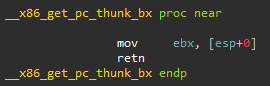
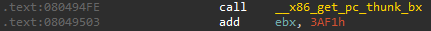
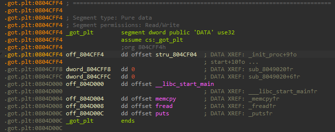

이번에 __x86.get_pc_thunk 함수에 대해 알아보려고 한다.  
먼저 코드부터 보면 다음과 같다.  

위의 코드를 보면 단순히 ebx 레지스터에 다음 실행 주소를 넣는 게 끝이다.

나는 해당 함수를 처음 봤을 때 다음과 같은 궁금증들이 생겼다.  
1. 왜 많은 레지스터들 중, ebx 레지스터에 넣는 것일까?  
2. 그래서 저 함수는 대체 어디다가 쓰는 것일까?  

첫 번째 궁금증부터 얘기를 하자면, 어떤 레지스터에 넣을지는 뒤에 붙는 .bx 같은 것으로 알 수 있다.  
예를 들어 __x86.get_pc_thunk.ax면 eax 레지스터에 담고, __x86.get_pc_thunk.cx면 ecx 레지스터에 담는다.  
위 사진을 보면 __x86.get_pc_thunk_bx로 되어 있으므로 ebx 레지스터에 남는 것이다.  

그럼 이제 두 번째 궁금증인 __x86.get_pc_thunk 함수는 대체 어디다가 쓰는 걸까?  
보통 __x86.get_pc_thunk 함수는 PIC에서 GOT의 base 주소를 획득하는 용도로 등장한다.  

위의 코드를 보면 __x86_get_pc_thunk_bx 함수를 호출하여 ebx 레지스터에는 현재 0x8049503라는 값이 들어있게 된다.  
그 후, add ebx, 3AF1h가 실행이 되는데, 그러면 ebx 레지스터에는 0x804CFF4 값이 들어있게 된다.  

실제로 해당 주소로 가보면 0x804CFF4가 .got.plt 섹션인 것을 확인할 수 있다.  
즉, 이를 통해 ebx 레지스터는 .got.plt 섹션을 가리키고 있는 레지스터가 된 것이다.  
추가로 아까 위에서 0x3AF1을 더한 이유는 .got.plt 섹션에서 0x8049503을 뺐을 때, 0x3AF1이기 때문이다.  

그럼 왜 힘들게 이러한 방식으로 got의 base 주소를 획득하는 걸까?  
우선 64bit에선 rip relative가 지원되기 때문에 다른 레지스터에 미리 rip 레지스터와 특정 주소를 더해 담아둬서 사용하는 방식으로 동작하지만, 32bit에서는 rip relative가 지원되지 않는다.  
때문에 32bit에 있는 eip 레지스터는 단순히 다음 실행할 명령어 주소만 가지고 있고, eip 레지스터에 add, sub, mov, lea 같은 명령어들을 사용하지 못하게 된다.  
그래서 이를 우회하기 위해 다른 레지스터에 현재 위치를 넣어두고 거기에 특정 값을 더하는 식으로 진행하는 __x86.get_pc_thunk 같은 방법이 사용되는 것이다.  